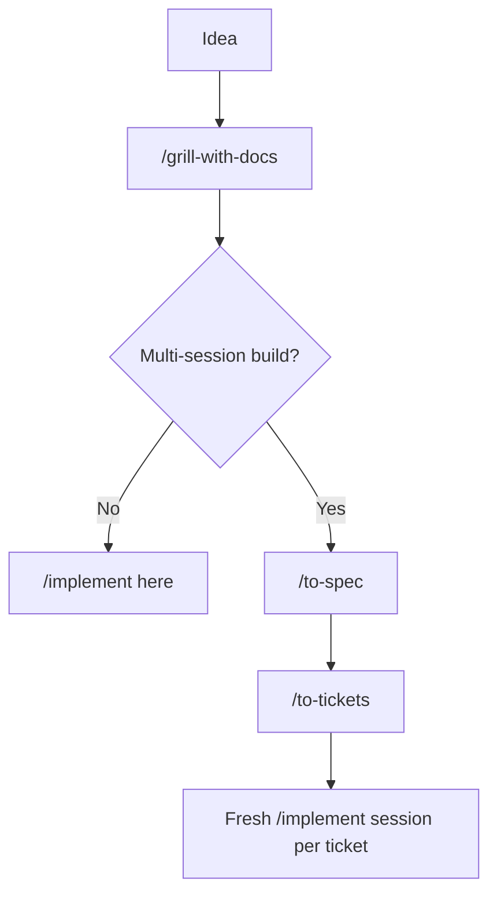
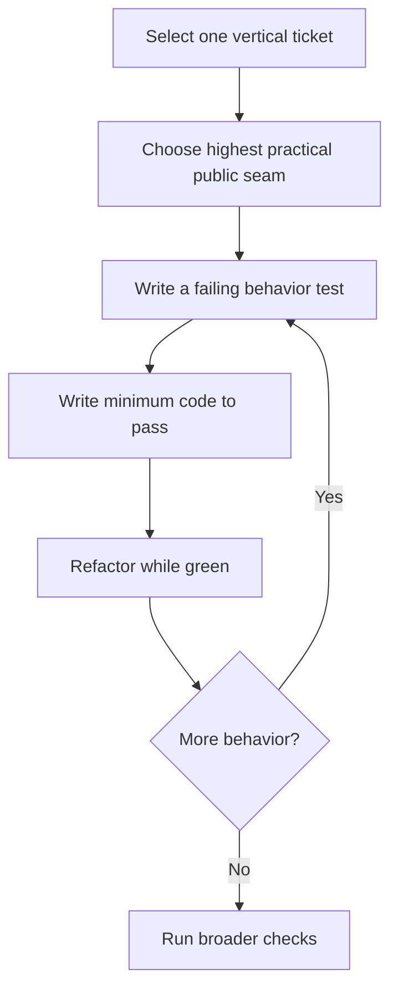
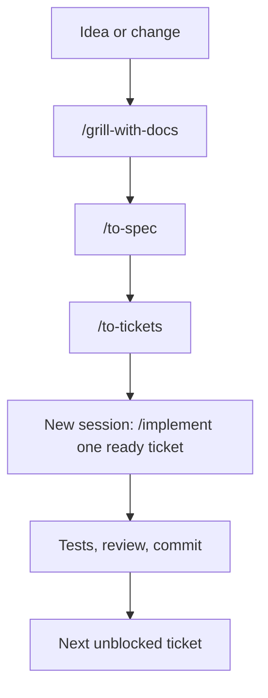
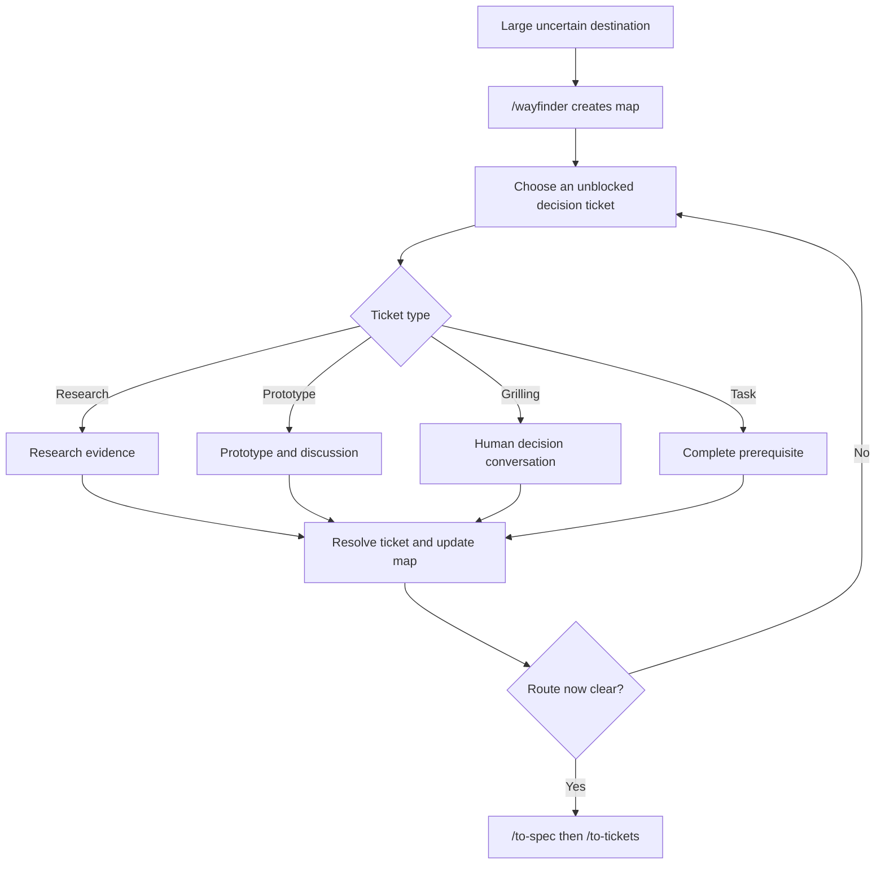
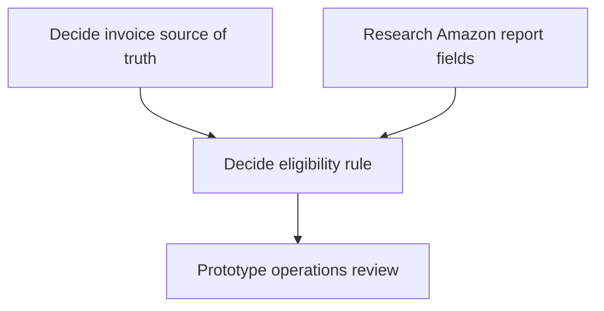
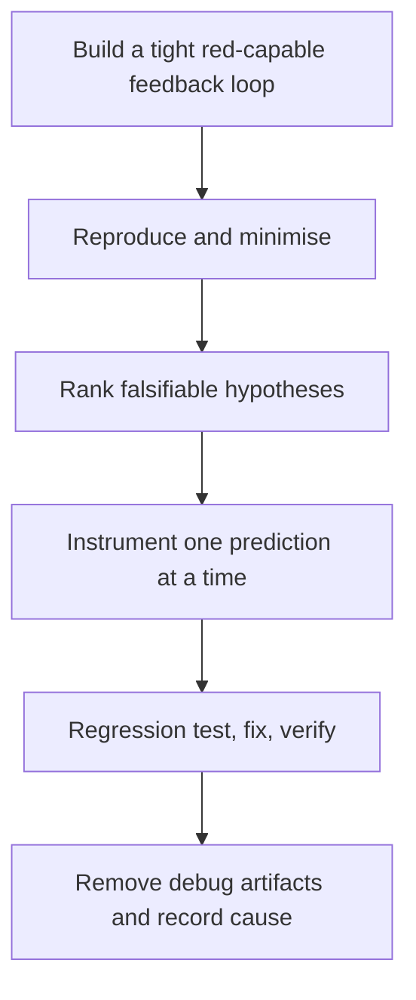
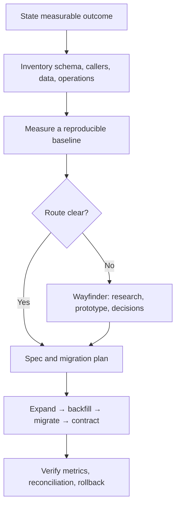

## Matt Pocock Skills: Project Structure and Workflow Guide

### How to Use This Guide

This guide serves two purposes:

1. **Tutorial:** read from Overview through the Worked Example to understand how the skills fit together.
2. **Reference:** jump directly to the workflow, artifact, or change type you are working with.

> [!info] Validation baseline
> This edition was checked on 2026-09-17 against the current `main` branch of Matt Pocock's skills repository, especially the [`ask-matt` workflow router](https://github.com/mattpocock/skills/blob/main/skills/engineering/ask-matt/SKILL.md) and the individual skill definitions linked in [[#Sources]]. Because the upstream collection changes, treat links to `main` as the current behavior and revalidate operational details after updating the installed skills.

This guide distinguishes three kinds of statement:

| Kind | Meaning |
|---|---|
| **Upstream behavior** | Required or explicitly described by the current skill definition. |
| **Tracker-specific behavior** | The concrete operation defined in `docs/agents/issue-tracker.md`. |
| **Recommended practice** | Additional operating guidance in this guide; useful, but not guaranteed automatically by a skill. |

If this is your first time using the methodology, begin with **Quick Start**, **Workflow Topology and On-Ramps**, **Core Concepts**, **Normal Feature Workflow**, and **Wayfinder Workflow**. The database and brownfield sections are specialized applications of those foundations rather than behavior prescribed by one upstream skill.

#### Learning Objectives

After reading the guide, you should be able to:

1. distinguish project memory, decision artifacts, specifications, and delivery tickets;
2. choose between the normal feature workflow and a Wayfinder effort;
3. select the correct workflow **on-ramp** for an idea, incoming request, difficult bug, foggy effort, or ready ticket;
4. choose deliberately between continuing, clearing, handing off, delegating, and compacting at a phase boundary;
5. explain when `map.md`, `spec.md`, agent briefs, feature folders, tickets, handoffs, and prototypes are created and updated;
6. distinguish an **effort issue** that removes uncertainty from a **feature issue** that delivers behavior;
7. distinguish interview, decision, and delivery frontiers;
8. select a useful testing seam and cut work into vertical slices;
9. move one ready ticket through TDD, review, verification, and closure;
10. adapt the workflow to bugs, refactors, database changes, and brownfield systems.

#### Scope of This Guide

This guide covers the primary engineering lifecycle and the supporting skills most relevant to planning, discovery, implementation, and review. The repository also contains productivity and specialist skills; a concise catalog appears in [[#Other Skills and Where They Fit]]. The guide explains the methodology, not a mandatory project-management framework: adapt tracker labels and session boundaries to the conventions of your team.

### Contents

- [[#Overview]]
- [[#Installation and Setup]]
- [[#Quick Start]]
- [[#Workflow Topology and On-Ramps]]
- [[#Core Concepts and Definitions]]
- [[#Efforts, Features, and Their Issues]]
- [[#The Four Layers]]
- [[#Artifact Lifecycle and Sources of Truth]]
- [[#Artifact Reference]]
- [[#Folder Structure]]
- [[#Tracker: the Shared Work System]]
- [[#Commands and Skill Types]]
- [[#How to Call the Skills]]
- [[#Phase Boundaries and Context Hygiene]]
- [[#TDD at the Agreed Seam]]
- [[#Two-Axis Code Review]]
- [[#Research Inside and Outside Wayfinder]]
- [[#How a Feature Folder Is Created]]
- [[#Normal Feature Workflow]]
- [[#Wayfinder Workflow]]
- [[#Handoffs: Carrying Session Context Forward]]
- [[#Prototypes: Learn Before Building Production Code]]
- [[#Worked Example: Amazon Refund Import]]
- [[#Playbooks by Change Type]]
- [[#Database Change Playbook]]
- [[#Brownfield Projects: Detailed Playbook]]
- [[#Operating Checklists]]
- [[#Common Failure Modes]]
- [[#Reference Note: Stable Local Issue Identity]]
- [[#Other Skills and Where They Fit]]
- [[#Sources]]

### Part I — Learn the Method

#### Overview

Matt Pocock's skills add an **engineering workflow layer** to a project. They do not impose a particular application architecture. Your `src/`, `tests/`, `apps/`, `packages/`, Docker, and CI folders remain your own design.

The workflow layer has three jobs:

1. Give every agent session a small amount of durable project context.
2. Store work artifacts in a predictable place: a tracker, or local Markdown files.
3. Separate four different kinds of knowledge that otherwise get mixed together:
   - domain language;
   - important decisions;
   - plans/specifications;
   - small deliverable units of work.

The central idea is that an agent should not rely on its chat history as the only memory of a project. Important information becomes a maintained artifact that a later session can read.

#### Installation and Setup

Install the skills in the target selected by your installer, then configure each repository separately. The official repository currently documents these two routes:

```text
# Claude Code managed plugin
claude plugins install mattpocock-skills

# Codex and other skills-compatible agents
npx skills@latest add mattpocock/skills
```

The routes have different ownership models:

| Installation route | Where skills live | How updates arrive | Can you edit the installed copy? |
|---|---|---|---|
| Claude Code plugin | Managed plugin installation | Plugin manager | Treat it as managed content |
| `npx skills` | Selected skills are copied as editable files into the selected project/agent target | `npx skills update` | Yes; local customization is possible |

> [!warning]
> Do not install both routes into the same agent environment unless you deliberately want duplicate skill definitions. Duplicate installations can make skill discovery and updates ambiguous.

Installation makes the skills available; it does **not** create a feature folder, Wayfinder map, specification, or delivery ticket. Repository-specific files are created later by setup and by the workflow commands that publish artifacts.

The `npx skills` installer lets you choose both the skills and the supported agent targets. Ensure that `setup-matt-pocock-skills` is included. After installation, run the repository setup skill once per repository:

```text
/setup-matt-pocock-skills
```

Depending on the harness, you may select the skill from a command menu or ask for it in natural language instead of typing an exact slash command. Setup explores the repository, proposes its changes for confirmation, and writes the small repository-operating layer described later in this guide. It has built-in templates for GitHub, GitLab, and local Markdown; other trackers such as Plane, Linear, or Jira use a free-form adapter described in `docs/agents/issue-tracker.md`. Re-run or revise setup only when those conventions change—for example, when moving from local Markdown to GitHub Issues. [Setup skill](https://github.com/mattpocock/skills/blob/main/skills/engineering/setup-matt-pocock-skills/SKILL.md)

#### Quick Start

Choose a workflow based on the kind of uncertainty you face—not merely on estimated code size.

| What arrived? | Start with | Why |
|---|---|---|
| A clear feature idea that still needs discussion | `/grill-with-docs` | Clarify scope, terminology, edge cases, and decisions. |
| A large initiative whose route is unclear | `/wayfinder` | Resolve load-bearing decisions before writing a spec. |
| A raw external issue or PR | `/triage <issue>` | Categorize, verify, and make it actionable or dispose of it. |
| A difficult bug or performance regression | `diagnosing-bugs` | Build a red-capable feedback loop before proposing a fix. |
| A ready, unblocked delivery ticket | `/implement <ticket>` | Implement one bounded vertical slice. |
| Repeated architectural friction without an agreed solution | `/improve-codebase-architecture` | Find and evaluate deepening opportunities. |
| A UI or state-model question that prose cannot settle | `prototype` | Make the decision concrete with throwaway code. |
| An interrupted session containing uncaptured state | `/handoff` | Brief the next session without duplicating durable artifacts. |

The common delivery routes are:

```text
Small, one-session change:
/grill-with-docs → /implement in the same context

Multi-session feature:
/grill-with-docs → /to-spec → /to-tickets → fresh /implement sessions

Uncertain initiative:
/wayfinder → resolve the decision frontier → /to-spec <map> →
/to-tickets <spec> → fresh /implement sessions
```

> [!rule]
> A planned multi-session implementation should normally receive one ready delivery ticket, not an entire large specification or Wayfinder map. A genuinely small change may instead be implemented directly from the clarified conversation.

#### Workflow Topology and On-Ramps

The collection is easier to understand as a topology than as one mandatory pipeline. The [`ask-matt` router](https://github.com/mattpocock/skills/blob/main/skills/engineering/ask-matt/SKILL.md) groups the skills by the position they occupy around a main idea-to-ship flow.

| Position | Purpose | Examples |
|---|---|---|
| Precondition | Configure the repository conventions assumed by later skills | `/setup-matt-pocock-skills` |
| Main flow | Clarify an idea, decide whether it needs durable planning, then deliver it | `/grill-with-docs`, `/to-spec`, `/to-tickets`, `/implement` |
| On-ramp | Turn a different starting situation into work that can merge onto the main flow | `/triage`, `diagnosing-bugs`, `/wayfinder` |
| Detour | Answer a bounded question, then return its result to the originating flow | `prototype`, `research`, `/to-questionnaire` |
| Codebase health | Find structural improvement candidates outside immediate feature delivery | `/improve-codebase-architecture` |
| Vocabulary layer | Supply concepts used beneath several workflows | `domain-modeling`, `codebase-design` |
| Phase-boundary tool | Move or reshape context between phases or sessions | Continue, clear, `/handoff`, subagent, compact |
| Standalone operation | Solve a situation that does not belong to the main flow | `resolving-merge-conflicts`, `/teach`, `/wait-what`, `wizard` |

##### What is an On-ramp?

An **on-ramp** is a starting situation that generates actionable work and then merges onto the main flow. It is not an extra phase that every feature must pass through.

| Starting situation | On-ramp | What it must produce before merging |
|---|---|---|
| Raw external issue or PR | `/triage` | A verified disposition or agent-ready brief |
| Difficult, intermittent, or performance bug | `diagnosing-bugs` | A red-capable reproduction, causal finding, and regression seam |
| Huge, foggy effort that cannot fit one session | `/wayfinder` | Resolved decisions sufficient for the named destination |

Triage is for raw work that arrived from elsewhere; tickets produced by `/to-tickets` are already agent-ready and should not be triaged again. Diagnosis may merge directly into a bounded fix, or route into architecture work when the deeper finding is that the system lacks a useful seam. A Wayfinder effort normally rejoins at `/to-spec` when its destination is an implementation-ready feature.

##### The Main-flow Size Branch

After grilling, ask whether the work can be delivered safely in the current context:



The spec-and-ticket path is a context-management tool, not a ceremony tax. Use it when the build is too large, interdependent, or durable to carry safely in one session. A small, precise change may proceed directly from shared understanding to implementation.

##### Detours return Evidence, not Hidden Decisions

Research, prototypes, and questionnaires do not replace the main flow. They return evidence or a verdict to the conversation, decision ticket, or specification that requested them:

```text
originating discussion → bounded detour → evidence/verdict → resume originating flow
```

The durable artifact must state what question the detour answered and where its primary source can be inspected.

#### Core Concepts and Definitions

##### On-ramp

A workflow entry point selected from the work's current condition: raw report, difficult bug, foggy effort, clarified idea, approved plan, or ready ticket. On-ramps converge on the main flow at different points.

##### Phase and Phase Boundary

A **phase** is a coherent kind of work inside a session, such as grilling, discovery, implementation, or QA. A **phase boundary** is the moment when the objective, required context, directory, harness, or owner changes. At that boundary, decide whether to continue, clear, hand off, delegate, or compact.

##### Context Pointer

A short linked gist that routes a later reader from a low-resolution artifact to the primary source containing the detail. A Wayfinder map entry such as `[Decide invoice authority](link): ERP posting status gates eligibility` is a context pointer: it conveys relevance without duplicating the decision record.

##### Agent Brief

A structured comment produced by triage when an issue or external PR becomes `ready-for-agent`. It records current and desired behavior, key interfaces, acceptance criteria, and exclusions. For that triaged item, the brief is the actionable contract; the original report and discussion remain context. [Agent brief guidance](https://github.com/mattpocock/skills/blob/main/skills/engineering/triage/AGENT-BRIEF.md)

##### HITL and AFK

**HITL** means human-in-the-loop: the work requires live preference, authority, access, or evaluation from a human who speaks for themselves. **AFK** means the agent can drive the bounded task independently while the human is away. In Wayfinder, research is AFK, grilling and prototype evaluation are HITL, and prerequisite tasks may be either.

##### Fixed point

The commit, branch, tag, or merge base against which a change is reviewed. Code review needs a fixed point so the reviewed diff is stable and reproducible.

##### Prefactoring

A behavior-preserving structural change made before a feature so that the feature becomes easier and safer to implement. It should have its own observable preservation rule and should not smuggle new behavior into a refactor.

##### Tracker

The authoritative system in which active work items and their relationships live. It may be GitHub, GitLab, Plane, Linear, Jira, or local Markdown under `.scratch/`.

##### Artifact

A durable output that later sessions can read: a tracker issue, Markdown file, ADR, research note, prototype branch, commit, test, or source file. Chat history is useful context, but it should not remain the only record of an important decision.

##### Seam

A **seam** is an interface or boundary through which behavior can be exercised, replaced, observed, or tested without knowing every internal detail.

Examples:

- an application service method that accepts a refund request and returns an outcome;
- an HTTP endpoint exercised by an integration test;
- an ERP gateway interface that can be replaced by a fake in tests;
- a command-line entry point invoked with a fixture;
- a browser-visible workflow tested through its user interface.

A good seam is high enough to exercise meaningful behavior. Testing a private helper may be easy, but it can miss the failure that occurs when several helpers and integrations interact.

> [!example]
> For refund creation, `create_refund(request)` is a stronger test seam than directly testing `calculate_tolerance(amount)`, because the service seam can exercise matching, eligibility, ERP interaction, and the final outcome together.

The methodology repeatedly asks for the **highest practical public seam** because fewer, stronger seams improve testability, reduce coupling to implementation details, and make the codebase easier for agents to navigate.

The word **practical** matters. A seam can be too low, appropriately high, or too high:

| Seam | Assessment | Reason |
|---|---|---|
| `calculate_tolerance()` private helper | Usually too low | Fast, but it proves only one implementation detail. |
| `create_refund(request)` application service | Often appropriate | Exercises the business workflow while dependencies can still be controlled. |
| A production ERP transaction executed through the public UI | Often too high for every TDD cycle | Realistic, but slow, costly, and difficult to isolate; keep a smaller number of end-to-end checks here. |

Choose the highest practical public seam that remains deterministic, sufficiently fast, and safe to run repeatedly. Use lower-level tests for algorithms with many cases, and a small number of higher-level checks to prove wiring.

##### Vertical Slice

A **vertical slice** is a small but complete path through every layer needed to deliver one observable behavior. It is called vertical because it cuts through the system—data, domain logic, API, interface, and tests—instead of completing only one horizontal technical layer.

Horizontal breakdown:

```text
Ticket 1: Create tables
Ticket 2: Build API
Ticket 3: Build UI
Ticket 4: Add tests
```

Vertical-slice breakdown:

```text
Ticket 1: Upload a refund report and preview valid rows
Ticket 2: Match one row to its source invoice and show eligibility
Ticket 3: Create an eligible ERP refund and persist its linkage
```

Each vertical slice should be independently demonstrable or verifiable, fit inside one fresh agent context, and leave the system in a coherent state.

> [!note]
> A vertical slice does not mean every ticket must touch every layer. It means the ticket contains everything required for its promised observable outcome and does not stop at an unusable intermediate layer.

Broad mechanical migrations are the main exception to a simple user-facing slice. Use **expand–migrate–contract**: introduce a compatible form, migrate callers in independently green batches, and remove the old form only after all callers have moved. Each batch still needs a verifiable system state; “change half the types and leave the build broken” is not a valid slice. If even migration batches cannot remain green independently, keep the dependency sequence on a shared integration branch and add a final integrate-and-verify ticket; make explicit that the green promise exists only at that integration point.

##### Tracer Bullet

A tracer bullet is a narrow vertical slice used to prove the path through the system early. It gives fast feedback about architecture, integrations, and assumptions before the team invests in broad implementation.

##### Feedback Loop

A repeatable command or procedure that distinguishes success from failure. Examples include a focused test, HTTP script, browser automation, fixture-driven CLI command, reconciliation query, or benchmark. A useful loop must exercise the actual behavior and be fast enough to run repeatedly.

##### Context, Specification, and Decision

| Term | Purpose |
|---|---|
| Context | Stable domain vocabulary and distinctions in `CONTEXT.md`. |
| Decision | A resolved trade-off, often kept in an ADR or Wayfinder decision ticket. |
| Specification | Agreement about what behavior will be built and tested. |
| Delivery ticket | One bounded, implementable vertical slice. |
| Map | Index of decisions needed to reach a large destination. |
| Frontier | Open, unblocked, unclaimed tickets that are safe to work next. |
| Handoff | Temporary summary of session state not already stored durably. |
| Prototype | Throwaway artifact created to answer one design question. |
| Brownfield project | Existing system with behavior, dependencies, data, users, and historical decisions. |

#### Efforts, Features, and Their Issues

##### What is an Effort?

An **effort** is a bounded body of work aimed at reaching a destination when the route is not yet sufficiently clear. In the Wayfinder workflow, the effort is the container for:

- the destination;
- the map of known decisions;
- the current decision frontier;
- unresolved fog or “not yet specified” concerns;
- explicit out-of-scope boundaries;
- evidence from research, prototypes, grilling, and prerequisite tasks.

An effort is complete when the route and destination are clear enough to produce the next durable outcome. That outcome might be one feature specification, several feature specifications, an ADR, a migration plan, a recommendation not to proceed, or evidence that a proposed destination is infeasible. An effort does **not** normally remain open until all production code is delivered.

> [!definition]
> **Project** is the enduring product or repository. **Effort** is a temporary uncertainty-reduction initiative inside it. **Feature** is an agreed unit of observable behavior to deliver.

##### Effort versus Feature

| Dimension | Wayfinder effort | Feature |
|---|---|---|
| Primary question | “What route should we take?” | “What behavior will we deliver?” |
| Main artifact | `map.md` or a map issue | `spec.md` or a spec issue |
| Child issues | Decision/research/prototype/grilling/prerequisite issues | Vertical-slice delivery issues |
| Work product | Answers, evidence, decisions, boundaries | Production code, tests, migrations, documentation |
| Completion condition | Essential uncertainty is resolved | Acceptance criteria are implemented and verified |
| Frontier | Unblocked decision issues | Unblocked delivery issues |
| Typical successor | One or more specs, an ADR, plan, or no-go decision | Release, deployment, or next feature |

##### Effort Issues versus Feature Issues

The two issue sets may look similar in a tracker, but they carry different promises.

| Issue kind | Examples | It is resolved when | It should not do |
|---|---|---|---|
| Effort issue | Research a provider; prototype a state model; grill a policy choice; obtain a representative dataset | The question is answered or prerequisite supplied, with evidence recorded | Quietly become a production implementation ticket |
| Feature issue | Preview valid rows; reject an ineligible refund; persist an idempotency key | The observable behavior and acceptance criteria pass in production-quality code | Reopen foundational product decisions without routing them back to discovery |

A `wayfinder:task` is still an effort issue. It belongs there only if completing the task directly unblocks a decision—for example, obtaining a masked dataset needed to decide a migration strategy. “Build the entire import endpoint” is delivery work and belongs under the feature specification.

Do not reuse a decision ticket as the later implementation ticket. Preserve traceability instead:

```text
Why and evidence  → effort decision ticket
What we will build → feature specification
Delivery unit      → feature ticket
Proof               → tests, review, and verification evidence
```

##### Three Kinds of Frontier

The collection uses **frontier** at three levels. In every case it means work whose prerequisites are settled—not every open question or item.

| Frontier | Contains | Used during | Coordination rule |
|---|---|---|---|
| Interview frontier | Questions whose prerequisite decisions are already settled | Grilling | Ask the whole current frontier in one numbered round; answers reshape the design tree |
| Decision frontier | Open, unblocked effort issues whose answers can safely be pursued now | Wayfinder | Claim a ticket before work; resolve normally one non-research ticket per session |
| Delivery frontier | Open, unblocked feature tickets that can safely be implemented now | Feature delivery | Claim when the tracker/team convention or concurrent work requires it |

The interview frontier is conversational; the other two are tracker-backed dependency graphs. During grilling, fact-finding is the agent's responsibility and decisions belong to the human. A question that depends on an unsettled answer waits for a later round. [Grilling skill](https://github.com/mattpocock/skills/blob/main/skills/productivity/grilling/SKILL.md)

> [!question] Knowledge check
> If a ticket says “compare three identity providers and recommend whether we should proceed,” it is an effort issue. If it says “let a user sign in with the selected provider and show a recoverable error on denial,” it is a feature issue.

#### The Four Layers

| Layer | What it answers | Examples |
|---|---|---|
| Installed skills | How should the agent behave? | `SKILL.md` files for `/to-spec`, `/implement`, `tdd`, etc. |
| Repository operating memory | How does this project work? | `AGENTS.md`, `docs/agents/`, `CONTEXT.md`, ADRs |
| Planning and delivery artifacts | What are we trying to do, and what can be done next? | specs, tickets, Wayfinder maps, research notes |
| Product code | What does the application actually do? | `src/`, `tests/`, migrations, configuration |

Do not use one document for all four purposes. A feature spec is not a glossary; an ADR is not a ticket; a Wayfinder map is not an implementation plan.

#### Artifact Lifecycle and Sources of Truth

##### What Creates What, in Sequence

Not every project uses every row. Read the table as an artifact pipeline: each new artifact consumes the evidence and decisions produced before it.

| Sequence | Command or means | Inputs used to create or change the artifact | Artifact created or changed | When it is created or updated |
|---:|---|---|---|---|
| 1 | Install skills | Agent environment and chosen installation route | Installed skill definitions | Once per agent environment; updated through plugin management or `npx skills update` |
| 2 | `/setup-matt-pocock-skills` | Repository, chosen tracker, domain/triage preferences | `AGENTS.md`/`CLAUDE.md` pointers and `docs/agents/*` conventions | At repository onboarding; revised when conventions change |
| 3 | `domain-modeling` or `/grill-with-docs` | Stakeholder language, codebase evidence, existing docs | `CONTEXT.md`; sometimes ADRs | Lazily, when confirmed language or a significant decision emerges |
| 4A | `/grill-with-docs` | Feature idea, current behavior, constraints, human answers | Clarified conversation plus domain/decision updates | For an understandable feature before specification or direct small implementation |
| 4B | `/wayfinder` | Uncertain destination, repository context, existing decisions | Map and initial effort issues | When several unresolved decisions or multiple sessions block a trustworthy route |
| 4C | `/triage` | Raw external issue or PR, codebase evidence, maintainer judgment | Disposition, triage notes, agent brief, or out-of-scope record | When incoming work must be classified, verified, and made actionable |
| 5 | Grilling, `research`, `prototype`, or prerequisite work | One claimed effort issue, its dependencies, relevant context | Answer/evidence; updated issue, map, glossary, or ADR | Each time a decision-frontier issue is resolved |
| 6 | `/to-spec` | Clarified conversation **or** an explicitly referenced map plus resolved child issues; codebase/context/ADRs | Spec issue or `spec.md`; sometimes a feature folder | When intended behavior is sufficiently agreed; updated when requirements change |
| 7 | `/to-tickets` | Approved spec, seam/test decisions, scope, dependencies | Vertical-slice feature tickets and blocking graph | After spec approval; revised when open delivery work changes |
| 8 | `/implement <ticket>` using `tdd` and `code-review` | One ready ticket, parent spec, code, context, ADRs, current tests | Production code, tests, migrations/docs, commits, updated ticket | One bounded delivery session per ticket |
| 9 | `/handoff` when needed | Uncaptured conversation state, current working state, durable artifact links | Temporary handoff document | Only when another session cannot reconstruct the state from durable artifacts |

> [!note]
> Rows 4A and 4B are alternative entrances. A normal feature goes through clarification; an uncertain initiative uses Wayfinder until it can safely rejoin at `/to-spec`.

##### Artifact Lifecycle

| Artifact | Created by | Updated when | Complete when | Next consumer |
|---|---|---|---|---|
| `CONTEXT.md` | `domain-modeling`, often during `/grill-with-docs` | A domain term or distinction is resolved | Never permanently complete | Every later skill |
| ADR | `domain-modeling` after a significant trade-off | Normally superseded by a new ADR, not silently rewritten | Decision accepted | Specs, tickets, implementation |
| Wayfinder map | `/wayfinder` | A decision resolves or new fog becomes precise | No essential decision tickets remain | `/to-spec <map>` |
| Wayfinder decision ticket | `/wayfinder` | Research, prototype, grilling, or prerequisite task progresses | Answer is recorded and ticket resolved | Map and resulting spec |
| Feature spec | `/to-spec` | Intended behavior, scope, or testing decision changes | Agreement is sufficient for slicing | `/to-tickets <spec>` |
| Delivery ticket | `/to-tickets` | Clarifications, blockers, or status change | Acceptance criteria are verified | `/implement <ticket>` |
| Handoff | `/handoff` | Normally not maintained | Consumed by the next session | Suggested next skill |
| Prototype | `prototype` | During human evaluation | Its question is answered and verdict captured | Decision ticket, spec, or ADR |
| Agent brief | `/triage` when an item becomes `ready-for-agent` | New verified evidence or maintainer direction changes the contract | Current/desired behavior, interfaces, criteria, and exclusions are actionable | `/implement` or further planning when the item is too large |
| Out-of-scope record | `/triage` after a maintainer rejects an enhancement | A similar request is rejected or the prior decision is reconsidered | The durable scope decision and reasoning are recorded | Future triage |
| Research note | `research` | New evidence changes the finding | Evidence is sufficient for its decision | Decision ticket, ADR, grilling session, or spec |

##### Source of Truth by Phase

| Phase | Primary source of truth |
|---|---|
| Domain discussion | `CONTEXT.md` and relevant ADRs |
| Incoming request triage | Issue/PR, triage notes, maintainer disposition, and agent brief when present |
| Wayfinding | Map plus resolved decision tickets |
| Feature agreement | Spec issue or `spec.md` |
| Delivery planning | Delivery tickets and blocking relationships |
| Implementation | Selected ticket, parent spec, current code, and tests |
| Interrupted session | Durable artifacts plus a temporary handoff |
| Completed work | Code, tests, commits, ADRs, and closed tickets |

##### Context Pointers and Primary Sources

Later artifacts should point backward without copying all earlier detail:

```text
map context pointer → decision ticket → research/prototype primary source
spec provenance     → map and accepted decisions
delivery ticket     → parent spec
review evidence     → fixed diff and originating ticket
```

A context pointer contains a meaningful linked name and a one-line gist. The linked artifact remains authoritative. This keeps low-resolution maps and tickets readable while preserving the evidence chain.

> [!warning]
> Do not let a later chat silently become more authoritative than the current spec, ADR, or ticket. When a decision changes, update or supersede the durable artifact.

> [!question] Knowledge check
> Setup creates operating conventions, not feature work. `/wayfinder` creates the decision container. `/to-spec` creates the delivery agreement. `/to-tickets` creates the delivery graph. `/implement` changes the product.

#### Artifact Reference

This section answers five practical questions for each repository artifact: what it is for, what creates it, when it changes, what does not belong in it, and who reads it next.

##### `AGENTS.md` And `CLAUDE.md`

| Property | Explanation |
|---|---|
| Objective | A short entry point telling an agent how to operate in this repository. |
| Created by | Usually repository setup, a human maintainer, or the relevant agent bootstrap process. Use the filename recognized by your harness: `AGENTS.md`, `CLAUDE.md`, or both only when necessary. |
| Created when | Once, when agent operating conventions are introduced. |
| Updated when | Commands, validation procedures, repository boundaries, or pointers to authoritative documents change. |
| Keep out | Feature requirements, temporary status, large generated inventories, copied tracker content, and volatile implementation notes. |
| Consumers | Every agent entering the repository. |

Prefer pointers over duplication: “Read `docs/agents/issue-tracker.md` before publishing issues” is more stable than copying the entire tracker procedure into the root file.

##### `docs/agents/issue-tracker.md`

| Property | Explanation |
|---|---|
| Objective | Define which tracker is authoritative and how skills create, claim, link, block, resolve, and find issues. |
| Created by | `/setup-matt-pocock-skills` from the selected tracker template. |
| Created when | Repository setup is run and a tracker is selected. |
| Updated when | The tracker, required metadata, state names, claim convention, or local file convention changes. |
| Keep out | Individual feature status and duplicated issue contents. |
| Consumers | `/to-spec`, `/to-tickets`, `/wayfinder`, `/triage`, `/implement`, and any session manipulating work items. |

##### `docs/agents/domain.md`

| Property | Explanation |
|---|---|
| Objective | Tell agents how this repository records domain language and decisions—for example, where `CONTEXT.md` and ADRs live and what merits an ADR. |
| Created by | Repository setup. |
| Created when | Domain-modeling support is configured. |
| Updated when | The domain-document locations or decision-recording policy changes. |
| Keep out | The actual glossary and individual architecture decisions. |
| Consumers | `domain-modeling`, `/grill-with-docs`, `/to-spec`, and implementation sessions. |

##### `docs/agents/triage-labels.md`

| Property | Explanation |
|---|---|
| Objective | Map the triage skill's category and state vocabulary to the labels or metadata supported by the chosen tracker. |
| Created by | Setup when `/triage` support is installed/configured. |
| Created when | Triage is enabled for the repository. |
| Updated when | Tracker labels or the team's routing policy changes. |
| Keep out | The evidence and discussion for a particular reported issue. |
| Consumers | `/triage` and maintainers of the incoming queue. |

##### `CONTEXT.md`

| Property | Explanation |
|---|---|
| Objective | A concise domain dictionary: project-specific terms, distinctions, invariants, and relationships needed to reason correctly. |
| Created by | `domain-modeling`, often while `/grill-with-docs` exposes the first important vocabulary. |
| Created when | The project has a confirmed domain term worth preserving; it need not be generated speculatively on day one. |
| Updated when | A term is clarified, a distinction becomes important, or accepted language changes. |
| Keep out | General project documentation, implementation plans, temporary session state, exhaustive schemas, and unresolved guesses presented as facts. |
| Consumers | Grilling, Wayfinder, specification, ticketing, implementation, and review. |

##### `CONTEXT-MAP.md`

`CONTEXT-MAP.md` is optional. Use it when a large domain has several focused context documents and agents need a small index that tells them which one to read.

| Property | Explanation |
|---|---|
| Objective | Route an agent to the relevant domain-context file without making every session load every domain. |
| Created by | A maintainer or domain-modeling work when one `CONTEXT.md` becomes too broad. |
| Created when | Context is deliberately split by bounded domain or subsystem. |
| Updated when | Context files are added, renamed, merged, or their scope changes. |
| Keep out | Full glossary entries and feature plans; link to them instead. |
| Consumers | Agents deciding which context documents to load. |

##### `docs/adr/`

| Property | Explanation |
|---|---|
| Objective | Preserve significant accepted trade-offs, their context, alternatives, and consequences. |
| Created by | `domain-modeling` or a planning session after a consequential decision. |
| Created when | A decision is expensive to reverse, affects several parts of the system, or would otherwise be repeatedly relitigated. |
| Updated when | Usually only to correct factual errors or status. A changed decision normally creates a new ADR that supersedes the old one. |
| Keep out | Every small coding choice, mutable task lists, and detailed feature acceptance criteria. |
| Consumers | Specs, delivery tickets, implementation, review, and future decision work. |

##### Agent Briefs

An agent brief normally lives as a tracker comment on the issue or external PR being triaged.

| Property | Explanation |
|---|---|
| Objective | Turn a verified incoming report into a durable, behavior-oriented contract that an AFK agent can execute. |
| Created by | `/triage` when the maintainer moves an item to `ready-for-agent`; a quick state override should still offer to create one. |
| Created when | The category, current behavior, desired behavior, relevant interfaces, acceptance criteria, and exclusions are sufficiently known. |
| Updated when | New verified evidence or maintainer direction materially changes the actionable contract. |
| Keep out | Volatile line numbers, prescriptive file-by-file instructions, unsupported assumptions, and unrelated adjacent work. |
| Consumers | `/implement`, or `/to-spec` and `/to-tickets` when the brief reveals a larger multi-session feature. |

An agent brief is not identical to a feature spec. It is the triage output for one incoming issue or PR. If the resulting work is too large for one implementation context, use the brief as input to the normal planning flow rather than forcing it into one ticket.

##### `.out-of-scope/`

The out-of-scope knowledge base stores persistent records of **rejected enhancement concepts**, one file per concept rather than one file per issue.

| Property | Explanation |
|---|---|
| Objective | Preserve why an enhancement is outside the project and surface that decision when a similar request arrives later. |
| Created by | `/triage` after the maintainer rejects an enhancement as `wontfix`. |
| Updated when | Another equivalent request is rejected, or the decision is reconsidered. |
| Keep out | Bugs, temporary deferrals, and requests closed because the behavior already exists. |
| Consumers | Future triage sessions. |

When a similar request appears, triage surfaces the prior record to the maintainer rather than silently applying it. The maintainer may confirm, reconsider, or decide that the requests are distinct. [Out-of-scope guidance](https://github.com/mattpocock/skills/blob/main/skills/engineering/triage/OUT-OF-SCOPE.md)

##### Research Notes

Research findings live in a cited Markdown file in the repository, following its existing convention; `docs/research/` is a sensible default when none exists. A related tracker ticket records the decision-relevant conclusion and links to the file rather than replacing it.

| Property | Explanation |
|---|---|
| Objective | Preserve a decision-relevant question, method, trusted sources, findings, limitations, and recommendation. |
| Created by | The `research` skill, normally through a background agent, either for a Wayfinder ticket or a standalone planning question. |
| Created when | A consequential claim depends on codebase exploration, external evidence, experiments, or comparison. |
| Updated when | Better evidence changes the conclusion, a cited source becomes obsolete, or the decision question expands. |
| Keep out | Unsupported conclusions, raw source dumps, and implementation tasks unrelated to the question. |
| Consumers | Decision tickets, ADRs, specs, and reviewers. |

Research does not require Wayfinder. Use it directly whenever a spec, bug diagnosis, refactor, or architectural choice needs evidence. Use it *inside* Wayfinder when the research question is one dependency in a larger decision graph.

##### `.scratch/`

| Property | Explanation |
|---|---|
| Objective | Act as a local Markdown tracker containing maps, specs, issues, status, and dependency links. |
| Created by | The first publishing skill after local Markdown is selected; setup establishes the convention but does not need to pre-create every feature folder. |
| Created when | A local map or spec is first published. |
| Updated when | Tickets, answers, blockers, claims, statuses, or specifications change. |
| Keep out | Secrets, large binary assets, and uncatalogued temporary experiments. |
| Consumers | Every planning and implementation session using the local tracker. |

Choose its durability deliberately:

| Policy | Consequence |
|---|---|
| Commit `.scratch/` | Shared, reviewable team history; best when local Markdown is the real team tracker. |
| Keep it local but back it up | Suitable for one developer or private planning, but collaborators cannot rely on it. |
| Ignore and treat as temporary | It is not durable cross-machine or team memory; promote decisions and requirements to committed documents or a remote tracker before depending on them. |

> [!rule]
> The filename `.scratch/` does not make the contents disposable. Its retention policy determines whether it is a durable tracker or merely a temporary workspace.

### Part II — Apply the Method

#### Folder Structure

The exact structure depends primarily on where you track work.

##### Structure when Using GitHub, GitLab, Plane, Linear, or Another Tracker

```text
my-project/
├── AGENTS.md                         # or CLAUDE.md
├── CONTEXT.md
├── docs/
│   ├── agents/
│   │   ├── issue-tracker.md
│   │   ├── domain.md
│   │   └── triage-labels.md           # only if /triage is installed
│   ├── adr/
│   │   └── 0001-example-decision.md
│   └── research/
│       └── provider-comparison.md
├── src/
├── tests/
└── ...
```

In this configuration, **specs, implementation tickets, and Wayfinder maps are issues in the tracker**. They are not normally files in the repository.

##### Structure when Using Local Markdown Tracking

```text
my-project/
├── AGENTS.md                         # or CLAUDE.md
├── CONTEXT.md
├── docs/
│   ├── agents/
│   ├── adr/
│   └── research/
├── .scratch/
│   ├── add-refund-import/             # a feature folder
│   │   ├── spec.md
│   │   └── issues/
│   │       ├── 01-validate-input.md
│   │       ├── 02-match-invoice.md
│   │       └── 03-create-refund.md
│   └── refund-program/                # a Wayfinder effort folder
│       ├── map.md
│       └── issues/
│           ├── 01-decide-matching-rule.md
│           └── 02-research-report-variants.md
├── src/
└── tests/
```

Here, the **folder is the local equivalent of a parent issue or initiative**. It is created only when a skill publishes work to the configured local tracker.

#### Tracker: the Shared Work System

A **tracker** is the authoritative place where the project records work that has not yet been completed. It is not necessarily a commercial issue tracker.

| Tracker choice | What plays the role of an issue? | Best fit |
|---|---|---|
| GitHub Issues | A GitHub issue | Shared projects already using GitHub |
| GitLab Issues | A GitLab issue | GitLab-hosted projects |
| Plane, Linear, Jira, etc. | A native issue/task | Teams with an established work system |
| Local Markdown | A file under `.scratch/` | Solo work, experiments, private planning, no remote tracker |

In this methodology, a tracker is more than a to-do list. It stores relationships between work items: parent/child, blockers, status, comments, and links to code or prototypes. That lets a new agent session discover the current state without needing the previous chat transcript.

The setup skill records the chosen tracker in `docs/agents/issue-tracker.md`. From then on, when a skill says **publish**, **fetch a ticket**, **claim**, **resolve**, or **find the frontier**, it follows that document.

| Term | Meaning |
|---|---|
| Issue | Generic tracker record: an incoming request, specification, parent map, delivery item, or decision. |
| Ticket | An actionable child work item. A spec may be stored as an issue without being an implementation ticket. |
| Parent issue | A record grouping related work, such as a Wayfinder map. |
| Blocking edge | A dependency: ticket B cannot begin before ticket A resolves. |
| Status | Lifecycle state, such as `ready-for-agent`, `claimed`, or `resolved`. |
| Claim | A visible marker that one person or agent session has taken an open item. |
| Frontier | The set of open, unblocked, unclaimed tickets—the safe next work. |

##### Triage is a State Machine, not a Required Entrance

`/triage` is for incoming reports that need classification, verification, or missing information. It is not mandatory for a requirement you have already clarified or for a spec produced by `/to-spec`.

The canonical triage model uses one **category** and one **state** at a time:

| Axis | Values | Meaning |
|---|---|---|
| Category | `bug`, `enhancement` | What kind of reported work is this? |
| State | `needs-triage`, `needs-info`, `ready-for-agent`, `ready-for-human`, `wontfix` | What should happen next? |

Example transitions:

```text
needs-triage → needs-info → needs-triage → ready-for-agent
needs-triage → ready-for-human
needs-triage → wontfix
```

Use `ready-for-agent` when an agent can take the next action without an unavailable human decision. Use `ready-for-human` when product authority, access, or judgment is required. The repository's `docs/agents/triage-labels.md` maps these logical states to actual tracker labels.

##### Triage Request Surfaces and Outputs

Triage normally handles raw work that someone else submitted. According to tracker configuration, the request surface may include issues and external pull/merge requests. A collaborator's ordinary in-flight PR is not automatically triage work, although an explicitly named PR can still be triaged.

For one selected item, the upstream sequence is:

1. read the body, comments, labels, history, and—when applicable—the proposed diff;
2. search the codebase for an existing implementation and check `.out-of-scope/` for a prior rejection;
3. recommend a category and state to the maintainer and wait for direction;
4. verify the claim before grilling: reproduce a bug or test what a PR actually does;
5. grill only when the verified request still needs decisions;
6. apply the outcome and create the corresponding durable record.

| State | Durable output |
|---|---|
| `ready-for-agent` | Agent brief containing the executable contract |
| `ready-for-human` | Brief plus the reason human action is required |
| `needs-info` | Established facts and specific unanswered questions |
| `wontfix` because already implemented | Closing explanation pointing to the existing behavior |
| Rejected enhancement | Closing explanation plus an `.out-of-scope/` record |
| Rejected bug | Closing explanation; no out-of-scope record |

Every tracker comment generated by the triage skill must carry its prescribed AI-generated disclosure. When triage resumes later, read the earlier notes and reporter replies so resolved questions are not asked again. [Triage skill](https://github.com/mattpocock/skills/blob/main/skills/engineering/triage/SKILL.md)

#### Commands and Skill Types

> [!note] Invocation notation
> **User-invoked** and **model-invoked** describe who is allowed to initiate a skill, not whether its written name contains `/`. User-invoked skills are started explicitly by the user. Model-invoked skills may be selected automatically by the agent and may also be requested by the user. Slash commands, menus, mentions, or natural-language requests are harness-specific interfaces; examples in this guide use `/name` only as a readable convention.

In the official composition model, a user-invoked skill may use model-invoked disciplines as part of its work, but it does not silently launch another user-invoked workflow command. For example, `/implement` can apply `tdd` and `code-review`; it does not automatically decide to publish an unrelated spec with `/to-spec`.

##### User-invoked Skills

You explicitly call these, normally from an agent session.

| Command | Main purpose | Typical input |
|---|---|---|
| `/setup-matt-pocock-skills` | Configure the repository once. | The repository and your choices |
| `/grill-with-docs` | Clarify a feature or decision while building durable domain docs. | A loose idea or requirement |
| `/to-spec` | Turn a sufficiently discussed idea into a feature specification. | Current conversation; optionally a reference to an issue/folder |
| `/to-tickets` | Split a spec/plan into independent vertical delivery slices. | A spec issue/URL/path, plan, or current conversation |
| `/wayfinder` | Navigate a large, uncertain initiative through decision tickets. | A destination that is too unclear or large for normal planning |
| `/implement` | Implement a selected spec or ticket. | A specific issue URL/number or local ticket path |
| `/triage` | Move incoming issues through a triage state machine. | A tracker queue or selected issue |

##### Model-invoked Disciplines

These are reusable skills invoked by the visible workflow, or selected by the agent when appropriate.

| Skill | Function | Artifacts it may update/create |
|---|---|---|
| `grilling` | Ask the questions that remove ambiguity. | Conversation, sometimes a decision ticket answer |
| `domain-modeling` | Make terminology and decisions precise. | `CONTEXT.md`, ADRs |
| `research` | Find evidence from high-trust sources. | Research note, Wayfinder ticket answer |
| `prototype` | Build a cheap concrete artifact to discuss. | Prototype asset and ticket link |
| `tdd` | Drive implementation through red-green-refactor. | Tests and code |
| `code-review` | Check standards and spec fidelity separately. | Review findings and fixes |
| `diagnosing-bugs` | Reproduce a symptom and test ranked hypotheses. | Reproduction harness, regression test, causal finding |
| `codebase-design` | Examine boundaries, responsibilities, and design options. | Design observations or proposed seams |
| `resolving-merge-conflicts` | Resolve conflicts by reconstructing intent from both sides. | Integrated code and passing checks |

##### Human and Agent Responsibilities

| Activity | Human responsibility | Agent responsibility |
|---|---|---|
| Business preference | Own the decision | Elicit constraints and expose consequences |
| Codebase discovery | Validate important findings | Explore code, history, tests, and artifacts |
| External research | Challenge consequential conclusions | Gather and cite evidence |
| Prototype | React, compare, and choose | Produce runnable alternatives that answer the question |
| Specification | Confirm intended behavior and scope | Synthesize discussion and codebase evidence |
| Implementation | Provide authority and unavailable context | Implement, test, review, and report evidence |
| Irreversible production action | Approve or perform when required | Prepare runbook, checks, and rollback plan |
| Final acceptance | Decide whether the result is acceptable | Demonstrate acceptance criteria and verification results |

#### How to Call the Skills

The argument is normally **a human-readable reference to the artifact you want the skill to work on**. You do not need to invent a special syntax beyond what your agent supports.

##### Examples Using a Real Issue Tracker

```text
/grill-with-docs Add Amazon refund imports. We need to validate the source invoice before creating the ERP refund.

/to-spec

/to-tickets https://github.com/acme/refund-service/issues/120

/implement https://github.com/acme/refund-service/issues/122
```

The first two commands can often be used in the **same session**, because `/to-spec` uses the preceding conversation. `/to-tickets` can also be used in that session after the spec exists and you approve the ticket breakdown.

##### Examples Using Local Markdown Tracking

```text
/grill-with-docs Add Amazon refund imports. We need to validate the source invoice before creating the ERP refund.

/to-spec

/to-tickets .scratch/add-amazon-refund-import/spec.md

/implement .scratch/add-amazon-refund-import/issues/02-match-invoice.md
```

##### Practical Command Rule

| Situation | Pass to the skill |
|---|---|
| You just discussed the work in this same session | Usually nothing; the skill can use the current conversation |
| The artifact was created in another session | Issue URL/number, or the local file path |
| You want to work on one implementation slice | One ticket, not the whole epic/spec |
| You want to advance a Wayfinder effort | The map issue/URL, or `.scratch/<effort>/map.md`; optionally name one child ticket |

When in doubt, name the artifact plainly: “Use `/implement` for issue #122” or “Advance the Wayfinder map at `.scratch/refund-program/map.md`.”

#### Phase Boundaries and Context Hygiene

A phase boundary occurs when the kind of work changes—for example, discovery becomes planning, planning becomes implementation, or an isolated prototype must return its verdict to the original discussion. Make context decisions at these boundaries rather than interrupting a coherent phase arbitrarily.

| Choice | Use it when | What carries forward |
|---|---|---|
| Continue | The next work needs the current reasoning and the context remains healthy | Full current context |
| Clear | Nothing from this session is needed because durable artifacts fully describe the next task | Only repository/tracker artifacts |
| Handoff | Work moves to another harness, directory, person, or isolated side task | Portable Markdown summary plus artifact pointers |
| Subagent | A bounded task can run independently and return a report | The task result, not the entire side context |
| Compact | The same line of work must continue, but the window is becoming unwieldy | A compressed continuation context |

Recommended context pattern:

1. keep grilling, `/to-spec`, and `/to-tickets` in one coherent planning context when possible;
2. begin each substantial `/implement` ticket in a fresh context, using its ticket and parent spec as durable inputs;
3. use `/handoff` only when portability or uncaptured state requires it;
4. isolate prototypes and bring their verdict back through a handoff or durable decision record;
5. delegate independent fact-finding rather than asking the human for facts the agent can obtain.

> [!warning]
> Do not compact or clear merely because a tool exists. Clearing loses conversational state; compacting summarizes it; handing off creates a portable artifact; delegation branches one bounded task. Choose according to the information the next phase actually needs. [Ask Matt phase-boundary model](https://github.com/mattpocock/skills/blob/main/skills/engineering/ask-matt/SKILL.md)

#### TDD at the Agreed Seam

TDD is not a separate planning stage inserted before implementation. It is the working loop used by `/implement` after the ticket, acceptance criteria, and practical seam are understood.



The red step must be capable of failing for the behavior the ticket promises. A newly written test that passes before the change does not demonstrate that capability. Keep each loop small:

1. select one acceptance behavior;
2. exercise it through the pre-agreed seam;
3. see the correct failure;
4. add only enough production code to pass;
5. improve names and structure without changing behavior;
6. repeat until the ticket is complete.

> [!example]
> For “reject a refund whose ERP invoice is unposted,” begin with an application-service test that supplies an unposted ERP result and expects the rejected outcome. Do not begin by directly testing a new private predicate that the real workflow might never call.

If the seam proves unusable, stop and decide whether a small prefactoring ticket is required. Do not quietly replace the agreed behavior test with convenient low-level tests that cannot prove the acceptance criteria.

#### Two-Axis Code Review

The `code-review` discipline evaluates the diff from a named **fixed point** to `HEAD` from two independent perspectives. The fixed point may be a commit, branch, tag, or other resolvable Git reference; for branch review the skill uses the merge-base comparison so unrelated history does not enter the diff.

| Axis | Question | Typical evidence |
|---|---|---|
| Standards | Is the change maintainable and consistent with repository engineering rules? | Project instructions, conventions, tests, error handling, security, performance, clarity |
| Spec | Does the change implement the promised behavior completely and only within scope? | Selected ticket, parent spec, acceptance criteria, exclusions, ADRs |

Review both axes in separate parallel contexts, then present the findings side by side. A clean implementation can still solve the wrong problem; a spec-complete change can still violate important engineering standards. The Standards axis uses documented repository rules and, when they do not override it, a judgment-based Fowler code-smell baseline. Address or explicitly disposition every material finding before closing the ticket. [Code Review skill](https://github.com/mattpocock/skills/blob/main/skills/engineering/code-review/SKILL.md)

Example review request:

```text
Review main...HEAD on two independent axes:
1. repository standards; and
2. fidelity to .scratch/add-amazon-refund-import/issues/02-validate-source-invoice.md.
Keep the findings separate and rank them by impact.
```

#### Research Inside and Outside Wayfinder

Use `research` whenever a consequential decision depends on evidence. Wayfinder is useful only when that question participates in a larger dependency graph.

| Situation | Route |
|---|---|
| One library/API choice blocks an otherwise clear spec | Research directly, save the cited Markdown finding, then continue `/to-spec`. |
| Several research, policy, and prototype questions depend on one another | Create a Wayfinder effort and use research tickets in its decision frontier. |
| A bug hypothesis depends on framework behavior | Research as part of diagnosis; keep the reproduction as the arbiter. |
| An implementation detail has low consequence and can be verified locally | Inspect docs/code and proceed; a formal research note may be unnecessary. |

Good research is delegated to a bounded background task where the harness supports it. It follows claims to primary sources, writes one cited Markdown file in the repository, records limitations, and states which decision the evidence supports. It does not merely collect links or silently replace the human decision. [Research skill](https://github.com/mattpocock/skills/blob/main/skills/engineering/research/SKILL.md)

#### How a Feature Folder Is Created

##### Anatomy of the Feature Specification

Before discussing its storage, know what `/to-spec` publishes. It synthesizes the current conversation and codebase understanding; apart from confirming proposed test seams, it is not another requirements interview.

| Section | Purpose |
|---|---|
| Problem Statement | Describe the user's problem from the user's perspective. |
| Solution | Describe the intended solution from the user's perspective. |
| User Stories | Give extensive numbered coverage of actors, capabilities, benefits, edge cases, and error behavior. |
| Implementation Decisions | Preserve agreed module, interface, architecture, schema, API, and interaction decisions without volatile file paths. |
| Testing Decisions | Record the public seams, behavioral focus, modules under test, and relevant prior art. |
| Out of Scope | State explicit exclusions. |
| Further Notes | Preserve relevant material that does not belong in the preceding sections. |

Avoid file paths, line numbers, and working code snippets because they go stale. A short decision-rich fragment from a prototype—such as a state machine, reducer shape, or schema—is the exception when it expresses the accepted decision more precisely than prose. [To Spec skill](https://github.com/mattpocock/skills/blob/main/skills/engineering/to-spec/SKILL.md)

##### First: Choose Local Markdown as the Issue Tracker

During `/setup-matt-pocock-skills`, choose **Local Markdown** for the issue tracker. The setup writes `docs/agents/issue-tracker.md` with the local conventions.

This configuration tells later skills that “publish to the issue tracker” means “write files under `.scratch/`.”

##### Second: Run `/to-spec`

After you have discussed a feature, run `/to-spec`.

For local tracking, the skill derives a feature slug from the feature name and creates the feature folder as part of publishing the spec:

```text
.scratch/
└── add-amazon-refund-import/
    └── spec.md
```

For example, this request:

```text
/to-spec
```

after a conversation titled “Add Amazon refund import” results conceptually in:

```text
.scratch/add-amazon-refund-import/spec.md
```

You can also state the preferred slug before publishing:

```text
/to-spec Create this locally under .scratch/amazon-refund-import/.
```

If the spec follows a Wayfinder effort, explicitly pass the map path or issue. Two layouts are valid:

| Layout | Use it when | Example |
|---|---|---|
| Map and spec in the same folder | The effort converges on one feature and keeping its history together is simplest | `.scratch/refund-import/map.md` and `.scratch/refund-import/spec.md` |
| Separate effort and feature folders | One effort produces several specs, or discovery and delivery have different ownership/lifecycles | `.scratch/refund-program/map.md` → `.scratch/add-amazon-refund-import/spec.md` |

The methodology does not require a new folder merely because Wayfinder came first. Whichever layout you choose, the spec should contain a source/reference link to the originating map and resolved decision tickets. That link preserves why the behavior was chosen without copying the entire discovery history into `spec.md`.

##### Third: Run `/to-tickets`

`/to-tickets` reads the spec, proposes a ticket graph, asks you to approve it, and then creates the `issues/` subfolder:

```text
.scratch/
└── add-amazon-refund-import/
    ├── spec.md
    └── issues/
        ├── 01-validate-amazon-report.md
        ├── 02-match-source-invoice.md
        └── 03-create-and-link-erp-refund.md
```

The folder is not pre-created by installation. It appears only when there is a feature to publish.

##### When a Feature Folder is Updated

| Event | Change to the folder |
|---|---|
| Scope or intended behavior changes | `spec.md` is updated |
| A ticket needs more detail | The selected ticket file is updated |
| New work is discovered | A new numbered ticket file is added |
| A ticket is split | The original ticket is revised and new ticket files are created; blockers are corrected |
| Work is complete | Ticket status is updated; the folder remains as historical project memory if committed |

#### Normal Feature Workflow

For an ordinary **multi-session** feature where the problem is understandable after a proper conversation, use the durable planning path below. If the complete change safely fits the current context, proceed from grilling directly to `/implement` as described in [[#The main-flow size branch]].



##### Recommended Session Boundaries

| Activity | Same session? | Why |
|---|---|---|
| `/grill-with-docs` → `/to-spec` | Yes, normally | The spec is a synthesis of the conversation you just completed. |
| `/to-spec` → `/to-tickets` | Yes, normally | The agent can read the newly published spec and you can approve the ticket graph. |
| `/to-tickets` → `/implement` | Prefer a **new** session per ticket | A fresh context prevents discovery/planning chatter from diluting implementation focus. |
| `/implement` → next `/implement` | New session | Each ticket should fit a clean agent context and have a clear goal. |

It is a recommendation, not a mechanical rule. A very small change may be grilled, specified, ticketed, and implemented in one session. But for meaningful work, ending after ticket publication makes the next implementation session more reliable.

##### When a Stage May Be Skipped

The skills are composable, not a mandatory waterfall.

| Stage | It may be skipped when |
|---|---|
| `/triage` | You originated the work and it is already clear and verified. |
| `/grill-with-docs` | The issue or spec already contains the necessary decisions and shared vocabulary. |
| `/wayfinder` | One focused discussion can produce a trustworthy spec. |
| `/to-spec` | The change is genuinely one small, precise, directly verifiable ticket. |
| `/to-tickets` | The entire change fits safely in one implementation context. |
| `/handoff` | All relevant state is already captured in durable artifacts. |
| `prototype` | The decision can be understood and tested without a concrete interactive artifact. |

Skipping a stage is safe only when its intended output already exists or is unnecessary—not merely because the stage feels inconvenient.

##### What `/implement` Receives

The implementation session needs a concrete source of truth:

```text
/implement .scratch/add-amazon-refund-import/issues/02-match-source-invoice.md
```

or:

```text
/implement https://github.com/acme/refund-service/issues/122
```

The agent should read the ticket, its parent spec, the relevant glossary and ADRs, then inspect the current code. It should implement the slice, test it, run a code review, and commit.

##### Completing an `/implement` Session

The upstream `/implement` skill requires implementation, TDD where possible, regular focused checks, a full suite at the end, two-axis review, and a commit. The following tracker updates and frontier checks are **recommended operating practice** layered on top. Completion is a sequence, not simply “the code compiles”:

1. run the fastest focused feedback loop for each acceptance behavior;
2. run the repository's required wider suite—types, lint, build, integration, or end-to-end checks as applicable;
3. perform the two-axis Standards and Spec review;
4. fix or explicitly disposition the findings, then rerun affected checks;
5. commit the coherent slice according to repository convention;
6. update or close the ticket with the evidence, commit/PR, and any remaining limitation;
7. inspect dependencies so the next **delivery frontier** is visible;
8. start a fresh session for the next ready ticket when appropriate.

If concurrent delivery is possible, claim the next ticket according to team/tracker convention. Unlike Wayfinder's decision-ticket coordination, a delivery claim is not universally mandatory; the tracker instructions decide.

##### Completing the Whole Feature

Completing every child ticket does not by itself prove that the assembled feature satisfies the parent specification. `/to-tickets` deliberately does not close or modify its parent issue while publishing children, so define a feature-level acceptance convention for the repository.

Recommended closeout:

1. confirm that every delivery ticket is resolved with evidence;
2. run the checks that exercise behavior across ticket boundaries;
3. compare the assembled result with every user story, testing decision, and exclusion in the parent spec;
4. resolve cross-ticket gaps as new bounded tickets rather than editing completed history;
5. record deployment, migration, reconciliation, or release evidence where relevant;
6. update or close the parent feature according to tracker convention.

| Work type | “Done” means |
|---|---|
| Wayfinder decision ticket | Its question has an evidence-backed answer or completed prerequisite. |
| Delivery ticket | Its observable acceptance criteria pass in production-quality code. |
| Feature/specification | Its child work operates together and the complete specification passes acceptance. |
| Wayfinder effort | Its named destination has been reached; this is usually certainty, not all downstream production delivery. |
| Prototype | The human has evaluated it and the verdict is recorded. |
| Research | The cited evidence is sufficient for the decision it supports. |
| Handoff | The next session can continue without reconstructing uncaptured state. |

##### When Implementation Reveals New Information

Implementation is not always linear. Route discoveries according to their meaning:

| Discovery during `/implement` | Response |
|---|---|
| Missing implementation detail within agreed behavior | Clarify the selected ticket and continue. |
| New user-visible requirement | Stop; update the spec and rework open tickets. |
| New significant architectural trade-off | Stop; create an ADR or Wayfinder decision ticket. |
| Unrelated bug | Create a separate issue; do not expand the current ticket silently. |
| Required behavior-preserving structural change | Create or approve a prefactoring ticket and update blockers. |
| Original assumption is demonstrably wrong | Return to diagnosis, grilling, or Wayfinder rather than forcing the implementation. |

> [!rule]
> Do not silently increase a ticket’s scope to absorb newly discovered work. Preserve the distinction between clarification, requirement change, decision, bug, and refactor.

> [!question] Knowledge check
> A completed `/implement` session should leave more than code: it leaves passing evidence, handled review findings, an updated ticket, and a visible next delivery frontier.

#### When to Use Wayfinder Instead

Use `/wayfinder` **before** `/to-spec` when the destination is known but the route is still uncertain.

Examples:

- “We need a POS strategy supporting unit/package pricing, discounts, and ERPNext integration, but we do not yet know the data model or compatible app choices.”
- “We need to migrate several companies to ERPNext, but chart of accounts, opening balances, integrations, and rollout order are unknown.”
- “We need a refund-import system, but we do not yet know the authoritative source, tolerance rules, idempotency approach, or operational review flow.”

Do **not** use Wayfinder just because a feature has several tickets. Use it when unresolved **decisions** prevent you from writing a trustworthy specification.

#### Wayfinder Workflow

A Wayfinder **effort** is the parent decision-discovery container. Its child issues remove uncertainty; they are not miniature features.



##### What `/wayfinder` Creates

With a real tracker:

```text
Issue: Refund import delivery map        label: wayfinder:map
├── Child issue: Decide source of truth  label: wayfinder:grilling
├── Child issue: Research CSV variants   label: wayfinder:research
└── Child issue: Prototype tolerance UI  label: wayfinder:prototype
```

With local Markdown:

```text
.scratch/refund-import-program/
├── map.md
└── issues/
    ├── 01-decide-source-of-truth.md
    ├── 02-research-amazon-csv-variants.md
    └── 03-prototype-tolerance-rules.md
```

After charting, the upstream workflow launches each initially visible AFK research ticket in parallel through the research discipline, capturing its cited Markdown result on a throwaway research branch and linking it from the ticket. Charting itself does not hand-resolve HITL decision tickets. If the current harness cannot run background workers, preserve the same ticket boundaries and resolve those research items in later sessions instead. [Wayfinder skill](https://github.com/mattpocock/skills/blob/main/skills/engineering/wayfinder/SKILL.md)

##### What is in `map.md`

```md
# Refund import delivery map

## Destination

Produce an implementation-ready specification for a safe,
idempotent Amazon refund-import workflow.

## Notes

- Read `CONTEXT.md` and refund-related ADRs in every session.
- Firestore and ERP behavior must be verified against existing code.

## Decisions so far

- [Decide source of truth](issues/01-decide-source-of-truth.md):
  Firestore provides upload status; ERP provides posted movement truth.

## Not yet specified

- Determine how operations staff see ambiguous matches.

## Out of scope

- Automatic correction of historical ERP movements.
```

The map is deliberately short. It is an index; the detailed answer belongs in the child ticket that resolved the decision.

> [!question] Knowledge check
> If the map still contains an unresolved policy question that changes acceptance behavior, `/to-spec` is premature. If only implementation sequencing remains, the effort has probably reached its destination.

#### Handoffs: Carrying Session Context Forward

##### What a Handoff is

A **handoff** is a compact, temporary briefing for a fresh agent session. It answers:

> What has happened in this chat that is not already safely captured in the repository, tracker, commits, or documents?

Use:

```text
/handoff Implement the next unblocked refund-import ticket.
```

The resulting document summarizes the current conversation and includes a **Suggested skills** section for the next session. It should reference durable artifacts by issue URL or local path rather than duplicate their contents. The official skill saves the handoff in the operating system’s temporary directory, not in the repository. [Handoff skill](https://github.com/mattpocock/skills/blob/main/skills/productivity/handoff/SKILL.md)

##### When to Use a Handoff

| Situation | Use `/handoff`? | Why |
|---|---|---|
| You completed `/to-tickets` and the next session can read the ticket/spec | Usually no | The ticket and spec are already durable sources of truth. |
| You must stop midway through a complex investigation | Yes | Hypotheses, commands run, and next steps may exist only in the chat. |
| You have an unfinished prototype discussion | Yes | The next agent needs the question, artifact location, feedback, and next decision. |
| You are switching agents/models or handing work to a collaborator | Yes | It creates a concise continuation brief. |
| You are midway through implementation with uncommitted changes | Usually yes | It can name working-tree state, tests run, failures, and the next safe action. |
| Everything important is committed and linked from the ticket | Usually no | A handoff would duplicate durable records. |

##### Handoff Does not Invoke a Skill

`/handoff` does **not** run any suggested skill. It prepares a document for another agent to pick up.

So a handoff can recommend a prototype, but the next session must actually invoke the prototype skill:

```text
Session 1
  /handoff Validate the proposed package-pricing state model with a prototype.

Session 2
  Read the handoff.
  Invoke prototype for the named question.
  Record the decision in the relevant issue, ADR, or specification.
```

#### Prototypes: Learn Before Building Production Code

##### What a Prototype is

A prototype is intentionally throwaway code built to answer **one design question** quickly. It is not an early production feature.

| Question | Appropriate prototype |
|---|---|
| “Does this state machine or logic model feel right?” | One shareable HTML file with controls that exercise difficult cases and expose state. |
| “What should this UI look like?” | Several deliberately different UI variations on one route, switchable for comparison. |

The prototype skill makes a decision concrete. It is useful where prose conceals state transitions, edge cases, or subjective UI preference. [Prototype skill](https://github.com/mattpocock/skills/blob/main/skills/engineering/prototype/SKILL.md)

##### How to Invoke a Prototype

You can request it directly when it is installed and available:

```text
Use the prototype skill to test whether unit/package pricing, optional discounts,
and a “break package” operation produce an understandable POS state model.
```

Or it can be run through a Wayfinder prototype ticket:

```text
/wayfinder Advance the package-pricing map and work on the prototype ticket.
```

Or it can be recommended by a handoff:

```text
/handoff Create a logic prototype for the package-pricing ticket, then capture
the accepted state rules in the ticket and an ADR if warranted.
```

In every case, name the decision question. “Make a prototype” is too vague; “Test whether a package can be partially broken after a line discount is applied” is actionable.

##### Prototype Lifecycle

1. State the question in the issue, ticket, or conversation.
2. Build the smallest runnable artifact that makes the answer visible.
3. Have the human react to it.
4. Record the verdict in the decision ticket or feature spec.
5. Update `CONTEXT.md` or create an ADR only if there is durable domain language or a significant trade-off.
6. Keep only the validated decision in `main`; capture the throwaway prototype on a separate throwaway branch and link that branch from the relevant implementation issue.
7. If the prototype ran in another directory, harness, or isolated context, hand the verdict and primary-source pointer back to the originating discussion before continuing the spec.

The prototype skill explicitly advises no persistence by default, minimal polish, no production abstractions, and a trivial run path. It exists to learn quickly, not to become a hidden production dependency. [Prototype skill](https://github.com/mattpocock/skills/blob/main/skills/engineering/prototype/SKILL.md)

#### How to Advance a Wayfinder Map

This is the key operational loop.

##### 1. Open the Map and Find the Frontier

Start a new session with:

```text
/wayfinder Advance .scratch/refund-import-program/map.md.
```

or:

```text
/wayfinder Advance the “Refund import delivery map” issue.
```

The agent reads the map and child tickets. The **frontier** is the set of child tickets that are:

1. open;
2. unblocked because their dependencies are resolved;
3. unclaimed by another person/session.

You work one frontier ticket at a time. Never resolve more than one non-research decision ticket in a Wayfinder session; independent research tickets are the exception because they can run in parallel.

##### Why the Frontier Matters

The frontier prevents an agent from working on an attractive but premature question. A decision can be important and still not be ready because another decision must come first.



At the beginning, the frontier is **A and B**, not C or D. After A and B resolve, C becomes the frontier. This is a dependency-aware work queue, not a numbered checklist.

For local Markdown tracking, the conventions express this with `Blocked by:` and `Status:` lines. For a real tracker, native dependency links and assignment are preferred. Claim a ticket before beginning work so another session does not select it concurrently.

##### 2. Claim One Ticket

For local tracking, set the ticket status before beginning work:

```md
Type: grilling
Status: claimed
Blocked by: None
```

For a real tracker, assign the issue to the developer/session owner. The claim prevents two parallel sessions from solving the same question.

##### 3. Use the Ticket Type to Decide how the Session Proceeds

###### A. `wayfinder:grilling`

Example ticket:

```md
## Question

Should a refund be eligible when the source invoice exists in Firestore
but is not yet posted in ERP?
```

Run a live discussion. The human supplies business preference and constraints; the agent must not invent that answer by itself.

At resolution, use the configured tracker's operation:

1. record a concise answer—append `## Answer` for local Markdown, or post a resolution comment/note for a remote tracker;
2. update `CONTEXT.md` if a new domain term was defined;
3. create/update an ADR if the decision meets ADR criteria;
4. set `Status: resolved`;
5. add a one-line linked summary under `Decisions so far` in `map.md`.

###### B. `wayfinder:research`

Example ticket:

```md
## Question

Which Amazon refund-report variants contain the fields required to
calculate an expected refund amount?
```

The agent can work independently, consult sources, and produce cited findings. The output should be linked from the ticket rather than pasted wholesale into the map.

Then resolve the ticket and update the map index.

###### C. `wayfinder:prototype`

Example ticket:

```md
## Question

Which operations-review screen makes ambiguous invoice matches easiest
to resolve safely?
```

The agent makes a cheap concrete artifact: perhaps one HTML page with two or three variations. You react to it. The goal is not production code; it is a better decision.

Then the ticket links to the prototype, records the decision, and updates the map.

###### D. `wayfinder:task`

Example ticket:

```md
## Question

Obtain a representative production-like Amazon refund report with all
columns preserved.
```

This ticket is a prerequisite. It resolves when the necessary thing is done and the useful outcome is recorded: for example, the file location, sample size, or access details.

##### 4. Reveal New Tickets Gradually

When resolving a decision reveals another precise question, create a new child ticket.

Example:

1. You decide to use ERP posting status as part of eligibility.
2. This reveals a new question: “What should happen when ERP is unavailable during validation?”
3. Create a new grilling or prototype ticket if that question is now precise.

Do not create every imaginable ticket on day one. Wayfinder calls the area beyond known decisions the **fog of war**. Record a vague future concern in `Not yet specified` until you can state a clear question.

##### 5. Finish Wayfinder at Its Named Destination

When no essential decisions remain, Wayfinder is done. Planning is the upstream default: the map normally produces decisions rather than production deliverables. However, the destination may be a spec, a decision, a migration plan, a no-go recommendation, or—only when the map's `Notes` explicitly override the default—a change performed inside the effort.

| Destination | Normal exit |
|---|---|
| Implementation-ready feature | `/to-spec` → `/to-tickets` → `/implement` |
| Product or architecture decision | Decision record or ADR |
| Feasibility investigation | Evidence-backed recommendation or no-go decision |
| Migration discovery | Approved migration plan, often followed by one or more feature specs |
| Explicit in-map execution | Verified change and recorded result, only when the map's Notes permit it |

For the common software-delivery destination, the handoff is:

```text
/to-spec Use <map path or issue URL> and all resolved child decision tickets.
/to-tickets <new spec>
/implement <first ready implementation ticket>
```

Passing the map explicitly is especially important in a fresh session. The map supplies the destination and decision index; the child tickets contain the detailed answers that the spec must synthesize.

`/to-spec` after Wayfinder should therefore reference the map explicitly. A robust invocation is:

```text
/to-spec Use .scratch/refund-import-program/map.md as the originating effort.
Read every resolved child decision ticket it links, cite the map in the spec,
and flag any unresolved essential decision instead of inventing an answer.
```

So Wayfinder is not a competing workflow. It is an upstream discovery workflow that produces the certainty needed for `/to-spec` and `/to-tickets`.

#### Small Feature Example: No Wayfinder Required

Requirement:

> Show a validation message when an uploaded Amazon CSV contains no refund rows.

The user-visible behavior, boundary, and test seam are already clear. A Wayfinder map would add no value.

If this is unquestionably one safe implementation context, the shortest route is:

```text
/grill-with-docs → /implement in the same session
```

If you want a durable specification and tracker record—for collaboration, audit, or later scheduling—use:

```text
Session 1
  /grill-with-docs Confirm the empty-report behavior, message, and whether the
  upload should remain available for audit.

  /to-spec

  /to-tickets <spec>

Session 2
  /implement <single ready ticket>
```

The ticket can be one vertical slice:

```md
# Report an uploaded file with no refund rows

## What to build

When a valid Amazon CSV contains no refund rows, finish parsing successfully,
store no refund requests, and show an explicit “No refund rows found” result.

## Acceptance criteria

- A representative empty-refund fixture produces the explicit result.
- The upload does not create refund requests.
- A malformed file still follows the separate invalid-file behavior.
- Existing non-empty report behavior remains green.

## Blocked by

None.
```

This illustrates the purpose of a vertical slice: one ticket delivers the complete observable behavior, including parsing, outcome, and verification, without splitting the work into parser/API/UI/test tickets.

#### Worked Example: Amazon Refund Import

##### Starting point

You know the desired outcome:

> Import Amazon refund reports and create valid ERP refunds without duplicates.

But you do not yet know:

- whether Firestore or ERP is authoritative for eligibility;
- the amount-matching tolerance;
- how to handle ambiguous orders;
- what makes a request idempotent;
- what operations staff need to see before creation.

This is too uncertain for `/to-spec`. Start with Wayfinder.

##### How the Information Changes Form

| Stage | Input | Transformation | Durable output |
|---|---|---|---|
| Initial idea | “Import refunds safely” | Identify important unknowns | Wayfinder destination |
| Wayfinder | Destination + codebase evidence | Resolve one decision at a time | Map, decision tickets, research/prototypes, glossary/ADRs |
| Specification | Map + resolved decisions | Convert decisions into agreed behavior and testing seams | `spec.md` or spec issue |
| Ticketing | Approved spec | Cut behavior into vertical slices and blockers | Delivery tickets |
| Implementation | One ready ticket | TDD/feedback loop, code review, commit | Code, tests, evidence, closed ticket |

The same information should become more concrete at each stage. Later artifacts reference earlier evidence instead of copying every detail.

##### Session 1: Create the Map

```text
/wayfinder We need to reach an implementation-ready plan for importing Amazon refunds, validating source invoices, creating ERP refunds safely, and supporting operational review.
```

Local output:

```text
.scratch/refund-import-program/
├── map.md
└── issues/
    ├── 01-decide-source-of-truth.md          Type: grilling
    ├── 02-research-amazon-report-fields.md   Type: research
    ├── 03-decide-idempotency-key.md          Type: grilling
    └── 04-prototype-ambiguous-match-review.md Type: prototype
```

Because ticket 02 is an initially visible research ticket, a harness with background-agent support launches it after the map is charted. Its cited note is produced independently while HITL sessions address the grilling and prototype frontier. A harness without background execution leaves it ready for a later dedicated research session.

##### Session 2: Advance a Grilling Ticket

```text
/wayfinder Advance .scratch/refund-import-program/map.md and work on 01-decide-source-of-truth.md.
```

You discuss what “invoice exists” means. The decision becomes:

> Firestore confirms upload status; ERP confirms that the invoice is posted and can be linked. Both are required before creating a refund.

The agent updates:

```text
CONTEXT.md
docs/adr/0003-dual-invoice-validation.md
.scratch/refund-import-program/issues/01-decide-source-of-truth.md
.scratch/refund-import-program/map.md
```

##### Session 3: Consume or Complete a Research Ticket

```text
/wayfinder Advance .scratch/refund-import-program/map.md and inspect the result of
02-research-amazon-report-fields.md. If no background result exists, resolve that
research ticket now.
```

The background agent—or this fallback session—researches Amazon report field meanings and writes a cited note, for example:

```text
docs/research/amazon-refund-report-fields.md
```

The ticket records the conclusion and links to the research note. `map.md` receives only a one-line summary.

##### Session 4: Finish Discovery and Create a Spec

After all essential decisions are closed:

```text
/to-spec Use the resolved refund-import Wayfinder map to create a feature spec.
```

The resulting spec should retain an explicit provenance line, for example:

```md
Originating effort: [Refund import delivery map](../refund-import-program/map.md)
Decision inputs: all resolved child issues linked from that map
```

This may create:

```text
.scratch/add-amazon-refund-import/spec.md
```

This example uses a **new feature folder** because the broader refund-import effort could later produce more than one feature. For an effort that converges on exactly one feature, it is also valid to create `.scratch/refund-import-program/spec.md` beside `map.md`. The important rule is semantic rather than spatial: the map remains discovery history, the spec becomes the delivery agreement, and the spec references the map.

##### Session 4 or 5: Create Delivery Tickets

```text
/to-tickets .scratch/add-amazon-refund-import/spec.md
```

After your approval:

```text
.scratch/add-amazon-refund-import/
├── spec.md
└── issues/
    ├── 01-parse-and-preview-amazon-refund-report.md
    ├── 02-validate-source-invoice.md
    ├── 03-create-and-link-erp-refund.md
    └── 04-handle-duplicates-and-ambiguous-matches.md
```

The names may sound related, but the effort and feature issues make different commitments:

| Earlier effort issue | Answer it produced | Later feature ticket that consumes the answer |
|---|---|---|
| Decide the source of truth | Require both Firestore upload status and ERP posted status | Validate the source invoice through both systems |
| Research Amazon report fields | Identified reliable identifiers and amount fields | Parse and preview supported report rows |
| Decide the idempotency key | Chosen stable key and retry semantics | Create and link a refund without duplicates |
| Prototype ambiguous-match review | Accepted the manual-review interaction | Route ambiguous matches to the accepted review flow |

The earlier tickets are closed because their questions were answered. The later tickets are closed only when production behavior and tests satisfy the spec.

##### Session 5 Onward: Implement One Ticket at a time

```text
/implement .scratch/add-amazon-refund-import/issues/01-parse-and-preview-amazon-refund-report.md
```

When it is complete, start a new session for the next unblocked ticket:

```text
/implement .scratch/add-amazon-refund-import/issues/02-validate-source-invoice.md
```

#### Skills Theory: Why the Workflow Branches

##### Normal Feature Path: Certainty is Already Available

Use this when the answer to “what should we build?” can be reached through one substantive discussion. After clarification, branch again by delivery size:

```text
small:         clarify → implement
multi-session: clarify → specify → slice → implement
```

`/grill-with-docs` resolves ambiguity. For a multi-session feature, `/to-spec` records the agreement and `/to-tickets` creates implementable slices. For one safe context, durable planning artifacts are optional.

##### Wayfinder Path: the Route is not yet Visible

Use this when the answer depends on several unknown decisions.

```text
find the route → specify → slice → implement
```

Wayfinder avoids a common failure mode: writing a confident-looking spec before the key questions have actually been answered. Its tickets are decision-oriented, not implementation-oriented.

##### Why `map.md` and `spec.md` Are Separate

| Artifact | Question it answers | Should it contain |
|---|---|---|
| Wayfinder map | What decisions remain before we can plan safely? | Destination, decision index, fog, out-of-scope items |
| Wayfinder decision ticket | What is the answer to one uncertain question? | Question, evidence/discussion, answer, links to assets |
| Feature spec | What are we agreeing to build? | User stories, decisions, test strategy, scope |
| Implementation ticket | What small end-to-end behavior can be delivered next? | Outcome, acceptance criteria, blockers |

The map drops out of the **active** implementation loop once it has done its job, but it remains linked as discovery history. The spec and implementation tickets become the active source of truth for delivery; the map and decision issues explain why that direction was chosen.

#### Operating Rules

For a repository you work on alone with Pi or Codex sessions:

1. Configure one issue tracker per repository with `/setup-matt-pocock-skills`.
2. Use GitHub/Plane/Linear if you want visible persistent coordination; use `.scratch/` for private local planning.
3. Use `/grill-with-docs` before meaningful changes, especially when terms or scope are unclear.
4. Use `/wayfinder` only for multi-session uncertainty, not for every medium-sized feature.
5. Let Wayfinder complete before creating the delivery spec.
6. After grilling, implement directly when the complete change safely fits one context; otherwise publish the spec and tickets.
7. Keep `/grill-with-docs`, `/to-spec`, and `/to-tickets` together when useful.
8. Start a fresh implementation session for each substantial unblocked ticket and pass its explicit path or issue reference to `/implement`.
9. Make context-transfer choices at phase boundaries; do not use handoff, clear, compact, and delegation interchangeably.
10. Keep `CONTEXT.md` concise and domain-only; use ADRs only for significant trade-offs.

#### Playbooks by Change Type

##### New Requirements and Changes to Requirements

Do **not** triage every item. Use `/triage` for raw incoming work reported by someone else. It categorizes, verifies, requests missing information, and moves a report into a usable state. Work you originated enters the main flow directly. A multi-session feature uses:

```text
/grill-with-docs → /to-spec → /to-tickets → /implement
```

`/to-spec` publishes an agent-ready specification, so it does not need a redundant triage pass. Local Markdown work similarly proceeds from its `spec.md`, ticket, or `map.md`.

| Situation | Workflow |
|---|---|
| Clear multi-session requirement | `/grill-with-docs` → `/to-spec` → `/to-tickets` → `/implement` |
| Small, precise change still being discussed | `/grill-with-docs` → `/implement` in the same context |
| Existing small ready issue/ticket | `/implement <ticket>` |
| Large or uncertain requirement | `/wayfinder` → resolve decisions → `/to-spec <map>` |
| Existing spec, no implementation | Update the spec, then revise or regenerate its tickets. |
| Some tickets complete | Preserve completed history; revise only affected open tickets and blockers. |
| Significant decision overturned | New ADR supersedes the old one; update the spec/open tickets. |
| New uncertainty | Resume/create a Wayfinder decision effort before rewriting the spec. |

Example change request:

```text
/grill-with-docs Change the refund-import requirement: ambiguous invoice matches
must enter manual review instead of being rejected. Read the current spec and
open tickets first.
```

Then ask `/to-tickets` to revise the open tickets without modifying completed ones.

##### Refactoring

A refactor preserves externally observable behavior while changing internal structure. Make the preservation rule and test seam explicit.

For a small, understood refactor, create one normal ticket:

```text
/to-tickets Extract refund eligibility behind the existing service seam.
Behavior must not change; existing behavior tests must remain green.
```

When a feature needs structure first, use **prefactoring**:

```text
01 Introduce a refund-eligibility seam without behavior change
02 Add dual validation through the new seam       ← blocked by 01
03 Add manual-review output                       ← blocked by 02
```

For broad mechanical migrations, use expand–migrate–contract: add a compatible new form; migrate callers in independently green batches; remove the old form only after every caller moves. For unclear architectural friction, run `/improve-codebase-architecture`, choose a candidate from its report, grill through the design, and then plan it normally—or use Wayfinder if major decisions remain unresolved.

##### Bugs and Debugging

For a tracker-reported bug, begin with `/triage <issue>` when verification or requirements are unclear. Then use the diagnosing-bugs discipline before guessing a fix:



The feedback loop must exercise the actual symptom: ideally a failing test, otherwise an HTTP/CLI/browser script, trace replay, or minimal harness. Once the cause and a valid seam are known, implement the fix through the bug ticket. Before closing, re-run the original reproduction, pass the regression test, remove temporary diagnostics, and capture the actual cause in the commit/PR.

#### Database Change Playbook

Database work is never just a generic refactor: applications, reports, jobs, integrations, historical data, migrations, and backup/restore processes may all depend on the current shape.

> [!note]
> This playbook is this guide's application of the skills methodology to database work; it is not a separate upstream Matt Pocock skill.

##### Database Change Workflow



Start with an observable target, such as: “reduce p95 eligibility-query latency from 1.8s to below 250ms without increasing refund-write latency by more than 10%,” or “enforce one completed refund per source invoice while retaining historical duplicates for audit.”

Inventory before changing: schema, keys, constraints, indexes, triggers, views, stored procedures/jobs, migration history, all application/report/ETL callers, data quality/distribution, query plans, backups, restore history, maintenance windows, lock tolerance, and rollback mechanism. For SQL Server this normally includes catalog views, Query Store/plans, SQL Agent jobs, procedures, and connection configuration.

Build a feedback loop suited to the change:

| Change | Evidence |
|---|---|
| Query performance | Representative input, query plan, logical reads, latency baseline/p95/p99 |
| Integrity constraint | Valid/invalid fixtures with accepted/rejected writes |
| Schema migration | Production-like migration rehearsal, smoke tests, rollback rehearsal |
| Backfill | Counts/checksums proving every expected row moved exactly once |
| Deduplication | Before/after report showing retain/merge/quarantine decisions |

When a database decision is uncertain, use Wayfinder. Example decision tickets: identify every writer; decide historical duplicate handling; prototype unique-key/retry behavior; decide online migration and rollback; obtain a masked production-like sample.

For live schema changes, use compatible expand–migrate–contract:

| Phase | Example: move from `invoice_number` text linkage to `source_invoice_id` |
|---|---|
| Expand | Add nullable new column, index, and compatibility code. |
| Backfill | Batch populate and record unresolved rows/counts. |
| Dual-write/read | New writes populate both; compare values for divergence. |
| Migrate callers | Move each writer, job, report, and integration in bounded tickets. |
| Validate | Reconciliation queries, smoke tests, production metrics. |
| Contract | Enforce final constraint and remove legacy path later. |

Ticket this as independently verifiable outcomes, not horizontal “database/backend/UI” work. Each ticket needs a rollback point and verification evidence.

#### Brownfield Projects: Detailed Playbook

A brownfield project is an existing system with accumulated behavior, unknown dependencies, incomplete documentation, historical data, and prior decisions. The first goal is to turn unknowns into reliable context and feedback loops—not to make a large rewrite look tidy.

> [!note]
> This playbook is this guide's synthesis of the workflow for existing systems; it is not a single upstream skill definition.

##### Principles

1. The running system is evidence, not automatically the specification.
2. Discover before redesigning: read code, tests, migration/tracker history, operational docs, and data shape.
3. Prefer small reversible moves: adapters, compatibility layers, additive migrations, flags, narrow test seams.
4. Keep fact separate from decision: “the system does X” is not “it should continue doing X.”
5. Improve feedback loops before increasing agent autonomy.
6. Use the established domain language; clarify it rather than replacing it with generic jargon.

##### Phase 0: Safe Baseline

Before a meaningful change, establish how to run the app; execute tests/type checks/builds; locate deployment and data/migration systems; identify current branches/PRs; and learn what must not be touched (production credentials, generated/vendor files, compliance-sensitive integrations). Keep `AGENTS.md` short: it should point to durable sources, not become a generated inventory.

##### Phase 1: Configure without Inventing Knowledge

Run `/setup-matt-pocock-skills` and select the team’s real tracker. Create `CONTEXT.md` lazily from confirmed facts. A good early definition can include uncertainty:

```md
### Invoice upload record
The Firestore record currently used by the import service to determine whether
an invoice has been uploaded. Its relationship to an ERP invoice is still being investigated.
```

Do not assert a canonical model before the evidence exists.

##### Phase 2: Map Unknown Boundaries

For an unfamiliar cross-cutting change, start Wayfinder:

```text
/wayfinder Reach an implementation-ready plan for safely changing the existing
refund process, including current data flow, ERP integration, retry behavior,
and operational recovery.
```

Typical tickets: research the lifecycle; identify every writer/retry job; grill partial-failure behavior; prototype idempotency; obtain a masked trace. This stops a partial read of one module from becoming the project model.

##### Phase 3: Build Vocabulary and Feedback Loops

Use `domain-modeling` to resolve overloaded terms incrementally. When code and stakeholder language disagree, expose the contradiction rather than silently choosing one. Test at the highest practical public seam: service/integration tests for workflows, browser tests for UI behavior, fixture tests for transformations. If no valid seam exists, create a narrow seam/harness as prefactoring and record the limitation.

##### Phase 4: First Delivery and Ongoing Safeguards

Make the first improvement small and observable: a regression test, structured metric/log at an integration boundary, read-only diagnostic report, adapter, additive schema field with reconciliation, or a prototype. Avoid beginning with a framework rewrite, mass rename, integration replacement, destructive data cleanup, or tests modified only to fit a new implementation.

Before merging/deploying, check active changes, related tickets/PRs, background jobs/queues/reports, external clients, per-environment configuration, migration order/rollback, and monitoring required for verification. Store non-obvious dependencies in an artifact, not only a chat.

Brownfield “done” means the acceptance criteria and an appropriate feedback loop pass; data migrations have reconciliation evidence; tests/review pass; deployment/rollback is understood; and tracker links preserve the evidence and decisions.

##### Brownfield Mini-case: Duplicate Refunds

Suppose an existing production system occasionally creates two ERP refunds after a retry. Initial inspection shows:

- two API paths can create a refund;
- a scheduled retry job invokes the same stored procedure;
- the database has no unique constraint for source-invoice linkage;
- historical duplicates already exist;
- tests cover only the primary API path;
- operations staff sometimes initiate manual retries.

This is not yet a one-ticket bug fix. The intended historical-data policy and compatibility strategy are unresolved.

###### 1. Triage and Reproduce

Verify the issue and build a replayable feedback loop that reproduces the duplicate creation. Do not add a unique constraint yet: existing duplicates may cause the migration to fail, and another writer may still bypass the intended rule.

###### 2. Create a Wayfinder Effort

```text
/wayfinder Reach an implementation-ready plan that prevents duplicate refunds
across every writer, preserves the required audit history, and supports rollback.
```

Decision tickets:

```text
01 Research all refund writers and retry paths                 Type: research
02 Decide how historical duplicates should be represented      Type: grilling
03 Prototype the idempotency-key and retry state model         Type: prototype
04 Decide online constraint rollout and rollback               Type: grilling
05 Obtain a masked representative duplicate dataset            Type: task
```

###### 3. Produce the Spec from the Map

```text
/to-spec Use the duplicate-refund Wayfinder map and every resolved child ticket
to create the implementation-ready specification.
```

###### 4. Create Vertical Delivery Tickets

```text
01 Add idempotency observability and a compatibility schema
02 Backfill linkage keys and produce a reconciliation report
03 Route the primary API writer through the idempotent seam
04 Route scheduled and manual retries through the same seam
05 Enforce uniqueness after divergence reaches zero
06 Remove the legacy creation path in a later deployment
```

Each ticket delivers a verifiable system state. This combines the brownfield, database, seam, vertical-slice, Wayfinder, and feedback-loop concepts in one workflow.

##### Brownfield Evidence Ledger

In a difficult legacy system, maintain a small distinction between facts, interpretations, decisions, and planned changes. These may be comments on the effort issue rather than a new document.

| Record | Example | Appropriate home |
|---|---|---|
| Observed fact | “The scheduled retry job calls `CreateRefund` directly.” | Research/diagnosis note with code link |
| Uncertainty | “We have not found whether manual retries use the same procedure.” | Map `Not yet specified` or a research ticket |
| Decision | “All writers will use one idempotent application seam.” | Decision ticket and ADR if consequential |
| Requirement | “A repeated source event returns the original refund identifier.” | Feature spec |
| Delivery step | “Route the scheduled job through the idempotent seam.” | Vertical feature ticket |
| Evidence | “Replay test sends the same event twice and observes one ERP refund.” | Test plus ticket/PR result |

This ledger prevents three common brownfield errors: treating current behavior as intended behavior, treating a hypothesis as a fact, and treating a desired design as if it already existed.

> [!question] Knowledge check
> In brownfield work, “the code currently does X” is evidence. It becomes a requirement only after product and operational intent confirm that X must be preserved.

### Part III — Operate and Reference

#### Operating Checklists

##### Before `/to-spec`

- [ ] The user problem and desired outcome are understood.
- [ ] Load-bearing decisions are resolved.
- [ ] Relevant domain terms are recorded or confirmed.
- [ ] Applicable ADRs have been read.
- [ ] The intended testing seam is known and confirmed.
- [ ] If Wayfinder was used, no essential unresolved frontier remains.
- [ ] The map and decision tickets are explicitly referenced.

##### Before `/to-tickets`

- [ ] The spec describes behavior, scope, testing decisions, and exclusions.
- [ ] Proposed tickets are vertical slices, not database/API/UI layers.
- [ ] Each slice can be demonstrated or verified independently.
- [ ] Each ticket fits one fresh implementation context.
- [ ] Prefactoring and broad mechanical migrations are sequenced explicitly.
- [ ] Blocking relationships reflect genuine prerequisites.

##### Before `/implement`

- [ ] Exactly one ready ticket is selected.
- [ ] Its blockers are resolved.
- [ ] It is claimed when concurrent work is possible.
- [ ] Its parent spec/map context is linked.
- [ ] Acceptance criteria are observable.
- [ ] The relevant seam and feedback loop are available.
- [ ] Working-tree state and concurrent changes have been checked.

##### Before Closing a Ticket

- [ ] Acceptance criteria have been demonstrated.
- [ ] Focused tests and required full checks pass.
- [ ] Code review has completed and findings are handled.
- [ ] Original bug reproduction or migration reconciliation passes where applicable.
- [ ] Temporary debug instrumentation is removed.
- [ ] Prototype code is captured or discarded according to its lifecycle.
- [ ] Durable terminology and decisions are updated only where warranted.
- [ ] The commit/PR and tracker item link to the relevant evidence.

##### Before Closing a Feature

- [ ] Every child ticket is resolved with verification evidence.
- [ ] Cross-ticket behavior has been tested against the complete parent spec.
- [ ] Every user story, testing decision, and exclusion has been reviewed.
- [ ] Integration, migration, reconciliation, deployment, or release checks pass where applicable.
- [ ] Any remaining gap is represented by a new bounded ticket rather than hidden in a completed one.
- [ ] The parent feature has been updated or closed according to tracker convention.

##### At a Phase Boundary

- [ ] The next objective and required context are explicit.
- [ ] Continue was considered before introducing a context transfer.
- [ ] Clear is used only when durable artifacts fully describe the next work.
- [ ] A subagent receives one bounded independent task.
- [ ] Handoff is reserved for portability or meaningful uncaptured state.
- [ ] Compact is used when the same thread must continue with reduced context.

##### Before Using `/handoff`

- [ ] There is meaningful uncaptured session state.
- [ ] Durable artifacts are referenced rather than copied.
- [ ] Current branch, working-tree state, tests, and failures are stated when relevant.
- [ ] The next objective is explicit.
- [ ] Suggested next skills are named.
- [ ] Secrets and personal information are redacted.

#### Common Failure Modes

| Failure mode | Why it fails | Correction |
|---|---|---|
| Treating every skill as a mandatory stage | A composable topology turns into a heavyweight waterfall. | Select the correct on-ramp, then join the main flow at the earliest safe point. |
| Requiring a spec and tickets for every small change | Planning artifacts cost more than the one-context delivery they describe. | After grilling, implement directly when the whole change safely fits the current context. |
| Using Wayfinder for implementation tasks | Decision discovery and delivery become mixed. | Resolve decisions in Wayfinder, then create a spec and delivery tickets. |
| Treating `CONTEXT.md` as general documentation | The shared language becomes noisy and expensive to consume. | Keep it as a domain glossary only. |
| Writing a spec before resolving essential uncertainty | The spec looks precise but encodes guesses. | Use grilling, research, prototype, or Wayfinder first. |
| Sending `/implement` an entire large spec | The session lacks a bounded deliverable. | Select one unblocked vertical-slice ticket. |
| Creating database/API/UI tickets | No ticket produces usable behavior independently. | Slice by observable outcomes through all necessary layers. |
| Testing only private helpers | Tests miss failures at real collaboration points. | Test through the highest practical public seam. |
| Using a handoff as permanent documentation | Temporary summaries become stale and duplicate durable artifacts. | Update the spec, ticket, ADR, or code; hand off only uncaptured state. |
| Using handoff when clear, compact, or delegation fits better | The wrong context mechanism duplicates state or loses useful reasoning. | Make the choice deliberately at a phase boundary. |
| Treating a map gist as the decision itself | Low-resolution summaries drift away from their evidence. | Keep the decision in one primary artifact and link it with a context pointer. |
| Sending raw triage notes to implementation | The agent lacks a durable behavioral contract. | Create an agent brief before marking external work `ready-for-agent`. |
| Allowing prototype code into production quietly | Throwaway assumptions bypass normal engineering checks. | Capture the decision, then implement it normally. |
| Triaging every issue | Work you created or tickets already produced by planning acquire redundant ceremony. | Triage raw external issues and configured external PRs; do not retriage generated delivery tickets. |
| Editing completed tickets to match new requirements | Project history becomes misleading. | Preserve completed history and revise current specs/open tickets. |
| Starting a brownfield rewrite without a feedback loop | The team cannot distinguish improvement from regression. | Establish observable behavior and reversible seams first. |
| Renaming referenced local ticket files casually | Paths and blocking links break. | Prefer stable paths; change the title inside, or update every inbound reference. |

#### Reference Note: Stable Local Issue Identity

Once a local ticket path is referenced by a spec, blocker, handoff, commit, or another ticket, treat the path as its identity. Prefer changing the title inside the file over renaming it. If a rename is necessary, update all inbound references and blocking relationships in the same change.

#### Other Skills and Where They Fit

The following skills are useful but do not each require a full workflow chapter here. Availability and exact names depend on the installed version.

| Skill or convention | Type | Where it fits |
|---|---|---|
| `/ask-matt` | User-invoked | Route a described situation to the appropriate skill or flow; it is the topology reference for the main flow, on-ramps, phase boundaries, vocabulary layers, and standalone operations. |
| `/improve-codebase-architecture` | User-invoked | Identify repeated architectural friction and candidate improvements before grilling/specification. |
| `codebase-design` | Model-invoked | Reason about module boundaries, responsibility, coupling, and candidate seams during discovery or refactoring. |
| `wizard` | Model-invoked | Generate an interactive Bash wizard for steps only a human can perform: external dashboards, credentials, CI secrets, provisioning, migrations, and cutovers. Do not use it for actions the agent can perform directly. |
| `resolving-merge-conflicts` | Model-invoked | Reconstruct both sides' intent from primary sources, resolve every hunk without inventing behavior, run checks, and finish the merge/rebase rather than aborting it. |
| `/grill-me` | Productivity/user-invoked | Run the same rigorous interview without repository state or a durable `CONTEXT.md`/ADR trail; prefer `/grill-with-docs` when a working directory exists. |
| `grilling` | Model-invoked | Supply the questioning discipline used inside larger workflows. |
| `/to-questionnaire` | Productivity/user-invoked | Interview the current user about the recipient and information gap, then create a questionnaire for the external decision-maker; returned answers feed grilling or specification. |
| `/teach` | Productivity/user-invoked | Teach a concept over multiple sessions using the current directory as a stateful learning workspace. |
| `/wait-what` | Productivity/user-invoked | Pause and reconstruct confusing context, assumptions, or recent events before proceeding. |
| `writing-for-agents` | Model-invoked | Shape durable instructions and artifacts so later agents can consume them accurately. |
| `.out-of-scope` | Triage convention, not a skill | Record patterns of reports the project intentionally will not accept, so triage can apply policy consistently. |

The catalog changes over time. Consult the installed skill metadata and the official repository README for the authoritative list and invocation permissions.

#### Sources

- [Matt Pocock’s Skills repository and installation instructions](https://github.com/mattpocock/skills)
- [Ask Matt: workflow router, on-ramps, phase boundaries, and skill topology](https://github.com/mattpocock/skills/blob/main/skills/engineering/ask-matt/SKILL.md)
- [Setup Matt Pocock Skills](https://github.com/mattpocock/skills/blob/main/skills/engineering/setup-matt-pocock-skills/SKILL.md)
- [Local Markdown issue tracker template](https://github.com/mattpocock/skills/blob/main/skills/engineering/setup-matt-pocock-skills/issue-tracker-local.md)
- [To Spec](https://github.com/mattpocock/skills/blob/main/skills/engineering/to-spec/SKILL.md)
- [To Tickets](https://github.com/mattpocock/skills/blob/main/skills/engineering/to-tickets/SKILL.md)
- [Wayfinder](https://github.com/mattpocock/skills/blob/main/skills/engineering/wayfinder/SKILL.md)
- [Domain Modeling](https://github.com/mattpocock/skills/blob/main/skills/engineering/domain-modeling/SKILL.md)
- [Implement](https://github.com/mattpocock/skills/blob/main/skills/engineering/implement/SKILL.md)
- [Handoff](https://github.com/mattpocock/skills/blob/main/skills/productivity/handoff/SKILL.md)
- [Prototype](https://github.com/mattpocock/skills/blob/main/skills/engineering/prototype/SKILL.md)
- [Research](https://github.com/mattpocock/skills/blob/main/skills/engineering/research/SKILL.md)
- [TDD](https://github.com/mattpocock/skills/blob/main/skills/engineering/tdd/SKILL.md)
- [Code Review](https://github.com/mattpocock/skills/blob/main/skills/engineering/code-review/SKILL.md)
- [Triage](https://github.com/mattpocock/skills/blob/main/skills/engineering/triage/SKILL.md)
- [Writing Agent Briefs](https://github.com/mattpocock/skills/blob/main/skills/engineering/triage/AGENT-BRIEF.md)
- [Out-of-Scope Knowledge Base](https://github.com/mattpocock/skills/blob/main/skills/engineering/triage/OUT-OF-SCOPE.md)
- [Grilling](https://github.com/mattpocock/skills/blob/main/skills/productivity/grilling/SKILL.md)
- [Diagnosing Bugs](https://github.com/mattpocock/skills/blob/main/skills/engineering/diagnosing-bugs/SKILL.md)
- [Improve Codebase Architecture](https://github.com/mattpocock/skills/blob/main/skills/engineering/improve-codebase-architecture/SKILL.md)
- [Wizard](https://github.com/mattpocock/skills/blob/main/skills/engineering/wizard/SKILL.md)
- [Resolving Merge Conflicts](https://github.com/mattpocock/skills/blob/main/skills/engineering/resolving-merge-conflicts/SKILL.md)
